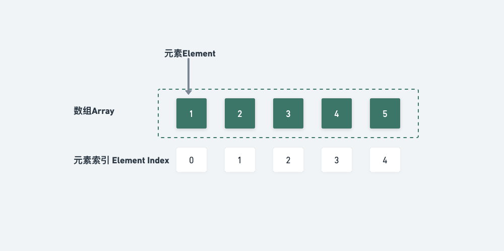

# 数组



::: tip
数组使用一组连续的内存空间，来存储一组具有相同类型的数据。

数组的最大特点的支持随机访问

访问元素、改变元素的时间复杂度为 O1

在尾部插入、删除元素的时间复杂度也是 O1

普通情况下插入、删除元素的时间复杂度为 On
:::

## 重点

- 数组：二分查找
- 数组：移除元素
- 数组：有序数组的平方
- 数组：长度最小的子数组
- 数组：螺旋矩阵 II

## 数组初始化

```py
foo = [0]*5
bar = [0 for _ in range(100)]
```

## 数组遍历

```py
# 通过索引遍历数组
for i in range(len(arr)):
    print(arr[i])
```

## 数组查找

```py
# 在数组中查找指定元素
def find(arr, target):
    for i in range(len(arr)):
        if arr[i] == target:
            return i
    return -1
```

## [1. 两数之和](https://leetcode.cn/problems/two-sum/description/)

::: details 两数之和 【哈希表】
@[code](./array/twoSum.py)
:::

## [11. 盛最多水的容器](https://leetcode.cn/problems/container-with-most-water/) :100:

::: details 盛最多水的容器 【双指针】
@[code](./array/maxArea.py)
:::

## [15. 三数之和](https://leetcode.cn/problems/3sum/)

::: details 15. 三数之和 【哈希】
:::

## [18. 四数之和](https://leetcode.cn/problems/4sum/)

::: details 18. 四数之和 【哈希】
:::

## [26. 删除有序数组中的重复项](https://leetcode.cn/problems/remove-duplicates-from-sorted-array/description/)

::: details 删除有序数组中的重复项 【快慢指针】
@[code](./array/removeDuplicates.py)
:::

## [27. 移除元素](https://leetcode.cn/problems/remove-element/)

::: details 移除元素 【快慢指针】
@[code](./array/removeElement.py)
:::

## [34. 在排序数组中查找元素的第一个和最后一个位置](https://leetcode.cn/problems/find-first-and-last-position-of-element-in-sorted-array/)

::: details 在排序数组中查找元素的第一个和最后一个位置 【二分】
@[code](./array/searchRange.py)
:::

## [35. 搜索插入位置](https://leetcode.cn/problems/search-insert-position/)

::: details 搜索插入位置 【二分】
@[code](./array/searchInsert.py)
:::

## [59. 螺旋矩阵 II](https://leetcode.cn/problems/spiral-matrix-ii/)

::: details 59. 螺旋矩阵 II
@[code](./array/generateMatrix.py)
:::

## [80. 删除有序数组中的重复项 II](https://leetcode.cn/problems/remove-duplicates-from-sorted-array-ii/description/)

::: details 删除有序数组中的重复项 II【快慢指针】
@[code](./array/removeDuplicates2.py)
:::

## [136. 只出现一次的数字](https://leetcode.cn/problems/single-number/)

::: details 136. 只出现一次的数字 【位运算】
@[code](./array/singleNumber.py)
:::

## [167. 两数之和 II - 输入有序数组](https://leetcode.cn/problems/two-sum-ii-input-array-is-sorted/)

::: details 两数之和 II - 输入有序数组 【左右指针】
@[code](./array/twoSum2.py)
:::

## [189. 轮转数组](https://leetcode.cn/problems/rotate-array/)

## [209. 长度最小的子数组](https://leetcode.cn/problems/minimum-size-subarray-sum/)

::: details 长度最小的子数组 【滑动窗口】
@[code](./array/minSubArrayLen.py)
:::

## [240. 搜索二维矩阵 II](https://leetcode.cn/problems/search-a-2d-matrix-ii/)

::: details 搜索二维矩阵 II 【二分】
@[code](./array/searchMatrix.py)
:::

## [283. 移动零](https://leetcode.cn/problems/move-zeroes/)

::: details 移动零
@[code](./array/moveZeroes.py)
:::

## [704. 二分查找](https://leetcode.cn/problems/binary-search/) :100:

::: details 二分查找 【二分】
@[code](./array/search.py)
:::

## [977. 有序数组的平方](https://leetcode.cn/problems/squares-of-a-sorted-array/)

::: details 有序数组的平方 【双指针】
@[code](./array/sortedSquares.py)
:::
