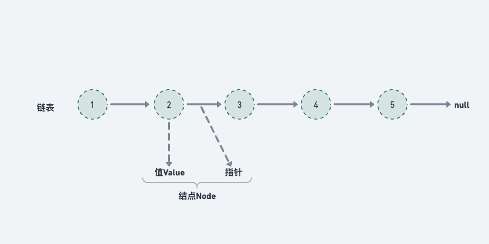

# 链表



- 单链表

```py
class ListNode:
    def __init__(self, val=0):
        self.val = val
        self.next = None
```

- 双链表

```py
class ListNode:
    def __init__(self, val=0):
        self.val = val
        self.next = None
        self.prev = None
```

## [19. 删除链表的倒数第 N 个结点](https://leetcode.cn/problems/remove-nth-node-from-end-of-list/)

::: details 19. 删除链表的倒数第 N 个结点
@[code](./list/removeNthFromEnd.py)
:::

## [21. 合并两个有序链表](https://leetcode.cn/problems/merge-two-sorted-lists/)

::: details 21. 合并两个有序链表
@[code](./list/mergeTwoLists.py)
:::

## [24. 两两交换链表中的节点](https://leetcode.cn/problems/swap-nodes-in-pairs/)

::: details 24. 两两交换链表中的节点
@[code](./list/swapPairs.py)
:::

## [25. K 个一组翻转链表](https://leetcode.cn/problems/reverse-nodes-in-k-group/)

::: details 25. K 个一组翻转链表
@[code](./list/reverseKGroup.py)
:::

## [86. 分隔链表](https://leetcode.cn/problems/partition-list/)

::: details 86. 分隔链表
@[code](./list/partition.py)
:::

## [141. 环形链表](https://leetcode.cn/problems/linked-list-cycle/)

哈希表方式，遍历访问结点，并判断是否在哈希表中

快慢指针方式，两个指针相遇就说明有环

::: details 141. 环形链表
@[code](./list/hasCycle.py)
:::

## [142. 环形链表 II](https://leetcode.cn/problems/linked-list-cycle-ii/)

::: details 142. 环形链表 II
@[code](./list/detectCycle.py)
:::

## [147. 对链表进行插入排序](https://leetcode.cn/problems/insertion-sort-list/)

::: details 147. 对链表进行插入排序
@[code](./list/insertionSortList.py)
:::

## [160. 相交链表](https://leetcode.cn/problems/intersection-of-two-linked-lists/)

::: details 160. 相交链表
@[code](./list/getIntersectionNode.py)
:::

## [203. 移除链表元素](https://leetcode.cn/problems/remove-linked-list-elements/)

::: details 203. 移除链表元素
@[code](./list/removeElements.py)
:::

## [206. 反转链表](https://leetcode.cn/problems/reverse-linked-list/description/)

::: details 206. 反转链表
@[code](./list/reverseList.py)
:::

## [234. 回文链表](https://leetcode.cn/problems/palindrome-linked-list/)

::: details 234. 回文链表
@[code](./list/isPalindrome.py)
:::

## [707. 设计链表](https://leetcode.cn/problems/design-linked-list/)

::: details 707. 设计链表
@[code](./list/MyLinkedList.py)
:::

## [876. 链表的中间结点](https://leetcode.cn/problems/middle-of-the-linked-list/)

::: details 876. 链表的中间结点
@[code](./list/middleNode.py)
:::

## [面试题 02.05. 链表求和](https://leetcode.cn/problems/sum-lists-lcci/)

## [面试题 02.07. 链表相交](https://leetcode.cn/problems/intersection-of-two-linked-lists-lcci/)

::: details 链表相交
@[code](./list/getIntersectionNode.py)
:::
