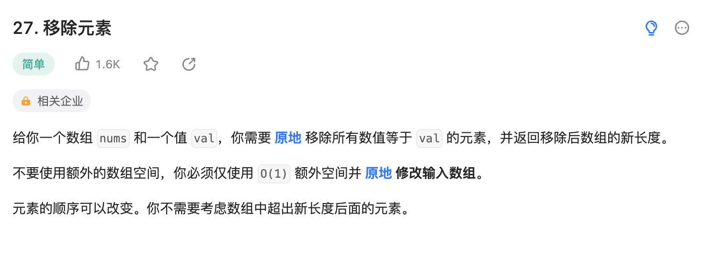
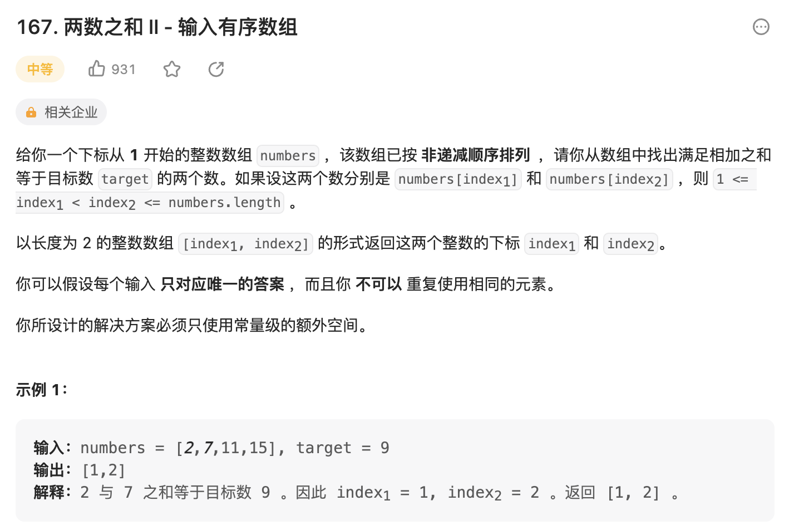
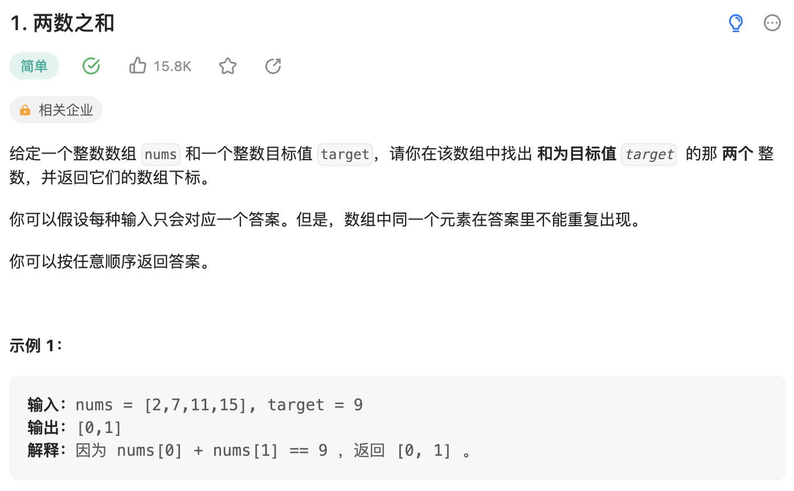
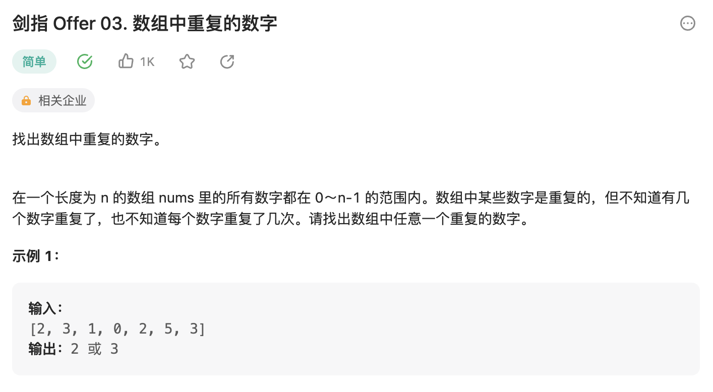

# 数组

## 快慢指针

### [26. 删除有序数组中的重复项](https://leetcode.cn/problems/remove-duplicates-from-sorted-array/description/)

> 快慢指针，快的先走，比较快的位置和慢的位置的值，如果不相等，快的位置赋值给 slow，然后 slow 往前走

> 当快的走完数组之后，nums[:slow] 就是整个数组去重之后的结果了

::: details 删除有序数组中的重复项
@[code](./array/removeDuplicates.py)
:::

### [80. 删除有序数组中的重复项 II](https://leetcode.cn/problems/remove-duplicates-from-sorted-array-ii/description/)

::: details 删除有序数组中的重复项 II
@[code](./array/removeDuplicates2.py)
:::

### [27. 移除元素](https://leetcode.cn/problems/remove-element/)

> 同样的快慢指针

::: details 移除元素
@[code](./array/removeElement.py)
:::

## 左右指针

### [167. 两数之和 II - 输入有序数组](https://leetcode.cn/problems/two-sum-ii-input-array-is-sorted/)

::: details 两数之和 II - 输入有序数组
@[code](./array/twoSum2.py)
:::

## 哈希表

### [1. 两数之和](https://leetcode.cn/problems/two-sum/description/)

::: details 两数之和
@[code](./array/twoSum.py)
:::

### [剑指 Offer 03. 数组中重复的数字](https://leetcode.cn/problems/shu-zu-zhong-zhong-fu-de-shu-zi-lcof/description/)

::: details 数组中重复的数字
@[code](./array/findRepeatNumber.py)
:::
