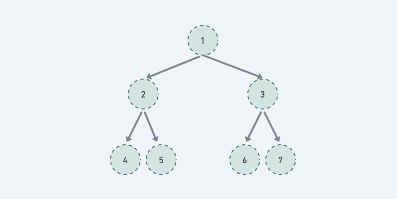

# 二叉树



## 定义

```py
class TreeNode:
    def __init__(self, val=0, left=None, right=None):
        self.val = val
        self.left = left
        self.right = right
```

高度：该结点到叶子结点

深度：根结点到该结点

## 种类

### 满二叉树

如果一棵二叉树只有度为 0 的结点和度为 2 的结点，并且度为 0 的结点在同一层上，则这棵二叉树为满二叉树

### 完全二叉树

在完全二叉树中，除了最底层节点可能没填满外，其余每层节点数都达到最大值，并且最下面一层的节点都集中在该层最左边的若干位置。若最底层为第 h 层，则该层包含 1~ 2^(h-1) 个节点

### 二叉搜索树

若它的左子树不空，则左子树上所有结点的值均小于它的根结点的值

若它的右子树不空，则右子树上所有结点的值均大于它的根结点的值

它的左、右子树也分别为二叉排序树

### 平衡二叉搜索树

它是一棵空树或它的左右两个子树的高度差的绝对值不超过 1，并且左右两个子树都是一棵平衡二叉树

## 遍历方式

### 深度优先遍历

先往深走，遇到叶子节点再往回走

- [144. 二叉树的前序遍历](https://leetcode.cn/problems/binary-tree-preorder-traversal/)(中左右)
- [94. 二叉树的中序遍历](https://leetcode.cn/problems/binary-tree-inorder-traversal/)(左中右)
- [145. 二叉树的后序遍历](https://leetcode.cn/problems/binary-tree-postorder-traversal/)(左右中)

::: details 二叉树的前中后序遍历
@[code](./tree/preorderTraversal.py)
:::

### 广度优先遍历

一层一层的去遍历

- [102. 二叉树的层序遍历](https://leetcode-cn.com/problems/binary-tree-level-order-traversal/)

::: details 二叉树的层序遍历
@[code](./tree/levelOrder.py)
:::

- [107.二叉树的层次遍历 II](https://leetcode-cn.com/problems/binary-tree-level-order-traversal-ii/)
- [429. N 叉树的层序遍历](https://leetcode-cn.com/problems/n-ary-tree-level-order-traversal/)

## LeetCode

### [98. 验证二叉搜索树](https://leetcode.cn/problems/validate-binary-search-tree/)

::: details 验证二叉搜索树
@[code](./tree/isValidBST.py)
:::

### [101. 对称二叉树](https://leetcode.cn/problems/symmetric-tree/)

::: details 101. 对称二叉树
@[code](./tree/isSymmetric.py)
:::

### [104. 二叉树的最大深度](https://leetcode.cn/problems/maximum-depth-of-binary-tree/)

::: details 104. 二叉树的最大深度
@[code](./tree/maxDepth.py)
:::

### [110. 平衡二叉树](https://leetcode.cn/problems/balanced-binary-tree/)

::: details 110. 平衡二叉树
@[code](./tree/isBalanced.py)
:::

### [111. 二叉树的最小深度](https://leetcode.cn/problems/minimum-depth-of-binary-tree/)

::: details 111. 二叉树的最小深度
@[code](./tree/minDepth.py)
:::

### [222. 完全二叉树的节点个数](https://leetcode.cn/problems/count-complete-tree-nodes/)

::: details 222. 完全二叉树的节点个数
@[code](./tree/countNodes.py)
:::

### [226. 翻转二叉树](https://leetcode.cn/problems/invert-binary-tree/)

::: details 翻转二叉树
@[code](./tree/invertTree.py)
:::

### [257. 二叉树的所有路径](https://leetcode.cn/problems/binary-tree-paths/)

::: details 257. 二叉树的所有路径
@[code](./tree/binaryTreePaths.py)
:::

### [404. 左叶子之和](https://leetcode.cn/problems/sum-of-left-leaves/)

::: details 404. 左叶子之和
@[code](./tree/sumOfLeftLeaves.py)
:::

### [530. 二叉搜索树的最小绝对差](https://leetcode.cn/problems/minimum-absolute-difference-in-bst/)

::: details 530. 二叉搜索树的最小绝对差
@[code](./tree/getMinimumDifference.py)
:::

### [617. 合并二叉树](https://leetcode.cn/problems/merge-two-binary-trees/)

::: details 617. 合并二叉树
@[code](./tree/mergeTrees.py)
:::

### [700. 二叉搜索树中的搜索](https://leetcode.cn/problems/search-in-a-binary-search-tree/)

::: details 700. 二叉搜索树中的搜索
@[code](./tree/searchBST.py)
:::
