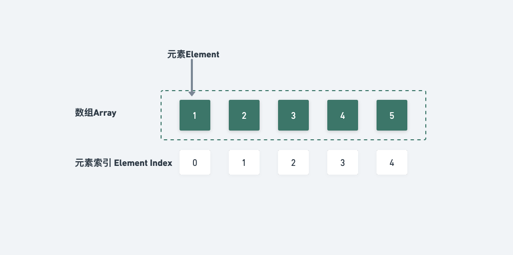

# 基础

## [骚气的位运算](01.md)

记录位运算的起因是最近开始看算法的内容，忽然发现其实在平时工作中也用到了，但是没有仔细的了解。

另外在算法的面试中，也有一些关于位运算的题目，再另一个，位运算本身就很骚气，因为涉及的最底层的玩意儿。

所以在使用中就会有一种装逼的嫌疑，并且这玩意儿确实高效。

## [链表](./02.md)


【链表 Linked List】是一种线性数据结构，插入删除高效，查询访问效率低下

### 初始化

```py
# 链表结点类
class ListNode:
    def __init__(self, x):
        self.val = x # 结点值
        self.next = None # 指向下一结点的指针（引用）
# 双向链表结点类
class ListNode:
    def __init__(self, x):
        self.val = x
        self.next = None # 指向后继结点的指针（引用）
        self.prev = None  # 指向前驱结点的指针（引用
```

## [数组](./03.md)



【数组 Array】，**相同类型元素**存储在**连续内存空间**的数据结构，查询高效，数组在初始化之后长度不可变，插入删除效率低

### 初始化

```py
foo = [0]*5
bar = [0 for _ in range(100)]
```

## [二叉树](./04.md)

## [排序算法](./05.md)

## [栈与队列](./06.md)

## [字符串](./07.md)

## [图](./08.md)

## [动态规划](./09.md)

## [剑指 offer](./10.md)

## [HOT 100](./11.md)
## [MySQL 之 IOPS、QPS、TPS](../interview/01.md)
