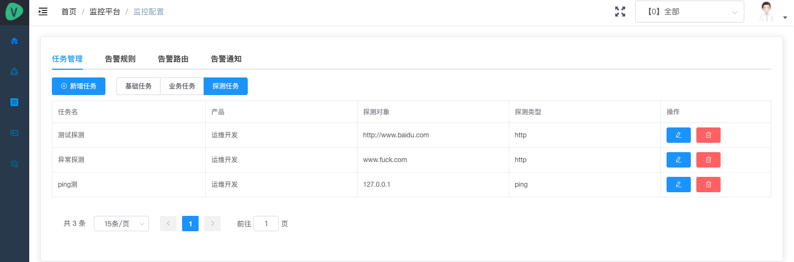

# 整体介绍

## 用到的开源软件

- [Thanos](https://thanos.io/)
- [Grafana](https://grafana.com/grafana/download)
- [Prometheus](https://prometheus.io/docs/prometheus/latest/getting_started/)
- [Alertmanager](https://prometheus.io/docs/alerting/latest/alertmanager/)
- [node_exporter](https://github.com/prometheus/node_exporter)

## 脑图

## 监控逻辑

1. 服务端配置 Prometheus 采集目标(机器、K8S、Redis、MySQL 等等)
2. 服务端配置 Prometheus Jobs 采集任务
3. 服务端配置 Alertmanager Alert Rules 告警规则
4. 服务端配置 Alertmanager Route 路由转发规则
5. 代理端(Prometheus 节点)定时获取采集目标、采集任务、告警规则，并渲染配置文件
6. 代理端(Alertmanager 节点)定时获取路由转发规则，并渲染配置文件
7. 代理端(NoticeServer)根据 Alertmanager 的告警，发送给目标用户
8. 客户端(自研封装 node exporter 等)提供 metrics 信息
9. 代理端(Prometheus 节点)根据采集目标，去抓取采集目标的 metrics 信息

## 前端展示

### 大盘列表

> 提供产品视角的 Grafana 图标，快速进入某个产品的 Grafana 视图查看监控指标实时状态。

### 监控大屏

> 显示某个产品下的正在发生的告警(告警数量)，具体的告警信息可以点击查看，可以针对告警配置维护时间等。

### 告警维护

> 显示了告警维护的维护策略列表，可以查看具体的告警维护策略，可以新增告警维护策略，当然在告警大屏中的【快速维护】也会显示在这里。这里的维护策略其实就是原生的 Alertmanager 的 Silences。

> 原生 Alertmanager 的 Silence 配置是这样的

### 告警故障

> 告警列表记录当前正在发生和历史里的告警项，事故列表记录的是已经发生并处理过的告警事故，主要用于复盘记录。

### 监控对象

> 监控对象，这里是我们定义的监控目标，可以是 ECS 主机，K8S 集群，Redis、MySQL、MongoDB、域名、IP。

- 机器默认从 CMDB 同步进入监控系统，并分配标签
- 机器的监控默认通过内网 IP 去读取 metrics 信息，也可以配置从外网读取
- 可以针对机器设置不监控
- 可以直接点击查看机器的监控图

### 监控配置

> 监控配置是监控系统中最重要的一块，主要分监控任务、告警规则、告警路由和通知组。

#### 监控任务

> 监控任务也就是对应 Prometheus 中的 job，关于告警任务，我们定义了三种：基础任务、业务任务和探测任务。其中要说明的是业务任务就是业务方提供的 metrics 的 URL 地址，探测任务就是通过 blackbox exporter 来实现，就是 http 探测、icmp 探测、tcp 探测。

- 基础任务(机器、K8S、进程、端口基础任务)

  

- 业务任务

  

- 探测任务(域名、icmp、tcp 探测任务)

  

#### 告警规则

> 告警规则，对应 Prometheus 中的 alert rule。这里需要说明的是，每一条告警规则都可以有它的告警子规则，因为告警默认的告警规则是兜底的规则，如果业务方需要告警规则的阈值调整，就可以添加告警子规则。

#### 告警路由

> 告警路由，对应 Alertmanager 中的 route。这里要说明的是，每个产品下都会有一条兜底的告警路由，也就是当前产品的所有告警都默认发送给当前产品的运维人员。当然如果当前产品下不同的告警发送给不同的负责人，就需要添加告警子路由。

#### 告警通知

> 告警通知，对应 Alertmanager 中的 receiver。告警通知组就是谁需要接收告警信息。目前我们的告警通知渠道是飞书。

