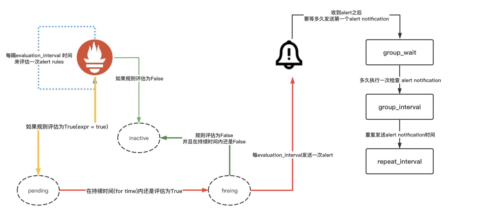

# 一条告警走的路

## 告警规则

```yml
groups:
  - name: GlobalAlertRules # 告警规则组的名称
    rules:
      - alert: InstanceDown # 告警名称
        expr: up{} == 0 # PromQL的表达式，计算是否满足触发条件
        for: 2m # 满足触发条件，持续时间
        labels: # 自定义标签
          level: crit
        annotations: # 告警的描述信息
          description: InstanceDown
          summary: 目标 {{ $labels.job }} 失联
```

> 这条告警规则的大致意思是：如果 InstanceDown 持续时间是 2 分钟，就产生告警

> for 这个参数主要用于降噪，比如网络有波动，那么目标就会有瞬间的失联，通过 for 参数就会过滤掉这些瞬时的波动

## 采样计算

> Prometheus 侧告警走的路

> 假设 Prometheus 配置的**scrape_interval**是 50s，**evaluation_interval**是 60s


> 上面图中圆圈表示原始的采样点

- 60s 时，第一次计算，低于告警阈值
- 120s 时，第二次计算，高于告警阈值，告警状态进入了 Pending 状态
- 180s 时，第三次计算，低于告警阈值，告警状态又进入了 Inactive 状态
- 240s 时，第四次计算，高于告警阈值，告警状态进入了 Pending 状态
- 300s 时，第五次计算，等于告警阈值，Pending 的状态持续达到了 2 分钟，告警状态进入了 Firing 状态，将告警发送给 Alertmanager
- 持续高于告警阈值
- 直到从 540s 开始到 600s 时，计算得到的值低于告警阈值，告警消失

## Alertmanager

> Alertmanager 侧告警走的路

上面告警产生之后，还需要经过 Alertmanager 的分组、抑制、静默、去重处理之后，才会将告警最终发送给接收者

## 时间周期

> 告警的理想接收时间

假设 Prometheus 配置的**scrape_interval**是 50s，**evaluation_interval**是 60s

在 Prometheus 侧的，按照上面的告警规则计算的话，至少是 2 分钟，Prometheus 才会将原始告警发送给 Alertmanager

假设 Alertmanager 配置的**group_wait**是 60s

那么用户接收到第一次告警的最快理想时间至少是 60\*2 + 60 = 3 分钟

## RoadMap

> 下面是我自己画的一条告警走的路



## 结语

当我们被问到告警为啥没发送到或者啥时候发送，这个流程算是梳理了一遍

所以有时候，当我们在 Grafana 上看到已经达到了告警阈值而没有接收到告警，那么这个流程其实也很好解释了原因
