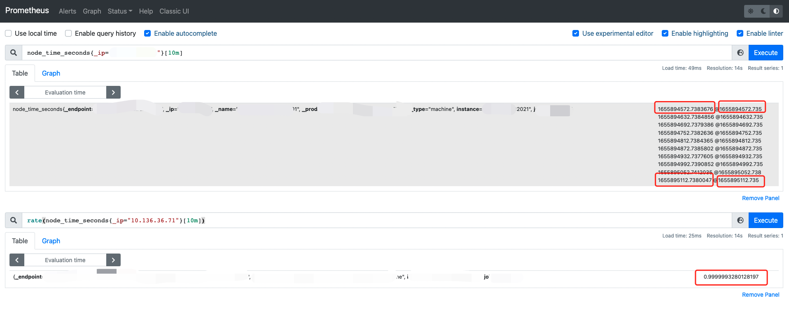
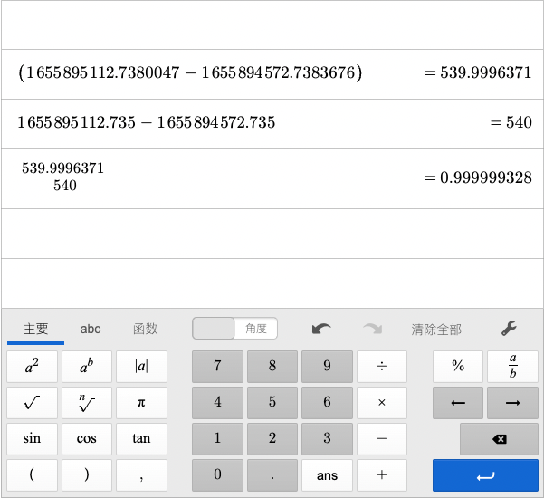

# Prometheus rate 函数

## 背景

> 由于我们监控体系是 Prometheus+Grafana 来做的，研发在配置 Grafana 大盘的时候，问到他的一个业务监控指标使用 rate 之后，Grafana 显示 No Data

1. Prometheus 抓取周期，我服务端配置的抓取周期是 60s 也就是 1m 抓取一次指标
2. 研发使用的 rate 函数，具体为 rate(xxx_xxx{yy="zz"} [1m])

## 粗糙解释

1. 由于抓取周期定义的是 1 分钟抓取一次
2. 由于 rate 函数的使用方法为：$interval 时间窗口下至少有两个指标才能输出
3. 所以$interval 至少是大于 1 分钟的

## rate

> rate 的翻译应该为平均每秒增加了多少

[源码地址](https://github.com/prometheus/prometheus/blob/main/promql/functions.go#L139)

1. 可以看出，rate 只能在 counter 的 metrics 类型上进行计算
2. 样本数量至少是 2 个，len(samples.Points) < 2
3. 最终值为：结果除以时间的秒数

10 分钟内的样本

rate 算法是 resultValue = resultValue / ms.Range.Seconds()

## 参考文档

[PromQL 查询之 rate 函数的使用](https://mp.weixin.qq.com/s/7z8n3abX9k39YL5kCopJqQ)
[Understanding the Prometheus rate() function](https://www.metricfire.com/blog/understanding-the-prometheus-rate-function/)
