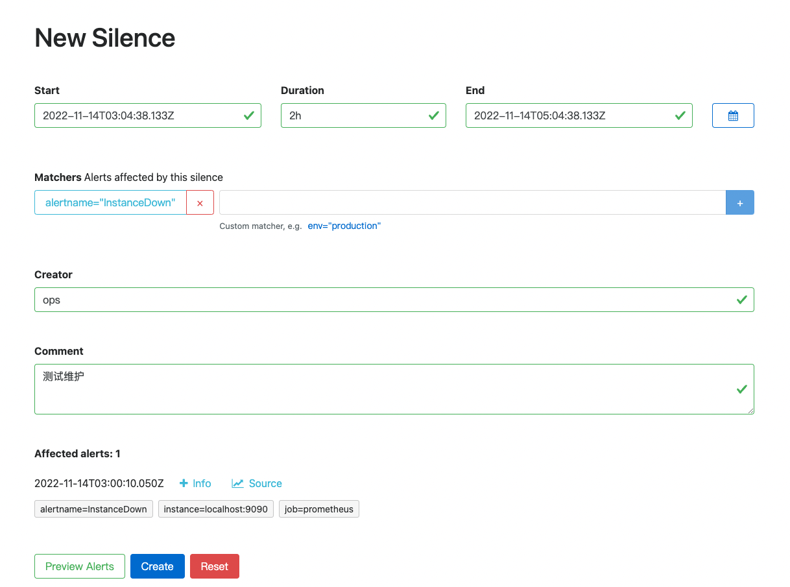

# 告警维护

## 页面操作

- 设置维护时长
- 设置维护规则匹配
- 设置维护人
- 设置维护说明

【Preview Alerts】可以看到当前配置的维护规则影响到的告警



## API 操作

POST: http://alertmanager:9093/api/v2/silences

```json
{
  "matchers": [
    {
      "name": "",
      "value": "",
      "isRegex": false
    }
  ],
  "startsAt": "",
  "endsAt": "",
  "comment": "",
  "createdBy": ""
}
```

## amtool 工具

例子

```sh
./amtool silence add alertname='InstanceDown' --alertmanager.url=http://127.0.0.1:9093/ --author="ops" --duration="1h" --comment='silence test'
```
