# 完整部署测试

> 按照单实例的模式部署测试

## Prometheus

> 版本：2.40.1 操作系统：Darwin

### [下载](https://prometheus.io/download/)

### 配置

#### 主配置文件

```yml
global:
  scrape_interval: 15s
  evaluation_interval: 10s
  scrape_timeout: 10s
  external_labels:
    monitor: "local"

# 告警alertmanager配置
alerting:
  alertmanagers:
    - static_configs:
        - targets:
            - 127.0.0.1:9093
# 告警规则文件
rule_files:
  - first_rules.yml

# 抓取任务配置
scrape_configs:
  - file_sd_configs:
      - files:
          - instances.yml
        refresh_interval: 10s
    job_name: basic
    metrics_path: /metrics
    scheme: http
    scrape_interval: 15s
    scrape_timeout: 10s
```

#### 告警规则配置

> first_rules.yml

```yml
groups:
  - name: GlobalAlertRules
    rules:
      - alert: 目标失联
        expr: up{job="basic"} == 0
        for: 20s
        labels:
          level: crit
        annotations:
          summary: "Instance {{ $labels._name }} down"
          description: "Instance {{ $labels._ip }} down"
```

#### 监控对象配置

> instances.yml

```yml
# 本地的node exporte
- labels:
    _ip: 127.0.0.1
    _name: node_expoter_01
    _endpoint: node_expoter_01
    _product_name: devops
  targets:
    - 127.0.0.1:9100
# 本地的Prometheus
- labels:
    _ip: 127.0.0.1
    _name: prometheus_local
    _endpoint: prometheus_local
    _product_name: devops
  targets:
    - 127.0.0.1:9090
# 假的测试实例
- labels:
    _ip: 10.10.10.10
    _name: node_expoter_02
    _endpoint: node_expoter_02
    _product_name: devops
  targets:
    - 10.10.10.10:9100
```

### 检查配置文件

```sh
cd prometheus-2.40.1.darwin-arm64
./promtool check config prometheus.yml
```

```txt
Checking prometheus.yml
  SUCCESS: 1 rule files found
 SUCCESS: prometheus.yml is valid prometheus config file syntax

Checking first_rules.yml
  SUCCESS: 1 rules found
```

### 启动服务

```sh
cd prometheus-2.40.1.darwin-arm64
./prometheus --config.file="prometheus.yml" --web.listen-address="0.0.0.0:9090" --web.enable-lifecycle
```

> 此时在 Prometheus UI 中查看 targets，会发现只有本地的 Prometheus 服务监控正常

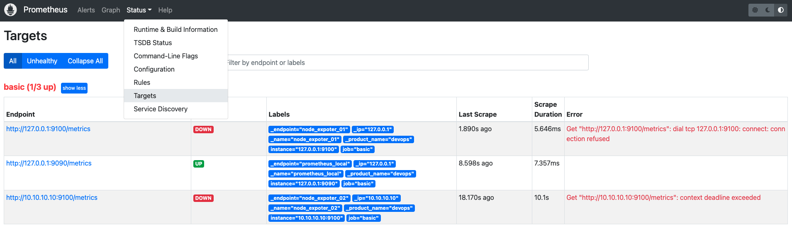

> 在 Prometheus UI 中查看 alerts，目前告警的如图

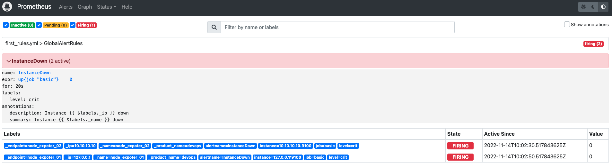

> 此时因为 Alertmanager 没有配置，Prometheus 服务报错如下，接下来我们配置 Alertmanager

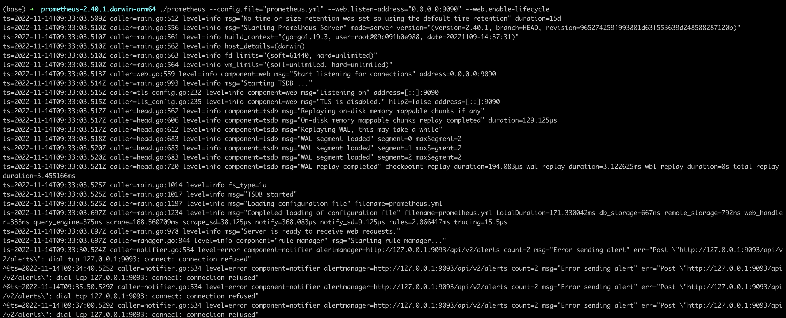

## Alertmanager

> 版本：0.24.0 操作系统：Darwin

### [下载](https://prometheus.io/download/)

### 配置

```yml
route:
  group_by: ["alertname", "level", "_product_name"]
  group_wait: 30s
  group_interval: 1m
  repeat_interval: 10s # 为了方便测试，我们配置重复发送告警的时间很短
  receiver: "devops"
receivers:
  - name: "devops"
    webhook_configs:
      - url: "http://127.0.0.1:5001/alerts"
inhibit_rules:
  - source_match:
      severity: "crit"
    target_match:
      severity: "warn"
    equal: ["alertname", "level", "_product_name"]
```

### 检查配置文件

```sh
cd alertmanager-0.23.0.darwin-arm64
./amtool check-config alertmanager.yml
```

```txt
Checking 'alertmanager.yml'  SUCCESS
Found:
 - global config
 - route
 - 1 inhibit rules
 - 1 receivers
 - 0 templates
```

### 启动服务

```sh
cd alertmanager-0.23.0.darwin-arm64
./alertmanager --config.file="alertmanager.yml" --web.listen-address="127.0.0.1:9093"
```

> 此时看到 Alertmanager 中的告警如图

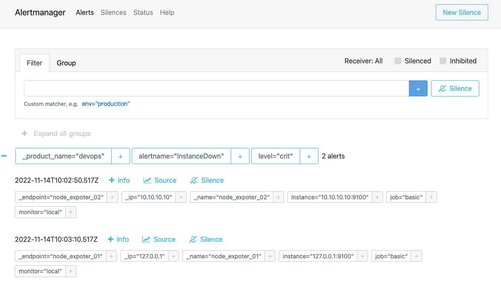

### 发送告警

> 根据上述的 Alertmanager 的配置文件，我们的 Webhook 服务还没有，所以暂时还发送不了告警信息给用户，接下来我们简单开发一个 Webhook 服务来发送飞书告警

#### Webhook 服务

```go

```

## NodeExporter

> 版本：1.4.0 操作系统：Darwin，我们原打算使用这个版本，但是发现这个版本在 Darwin 中启动不了，所以我们采取 docker 的方式启动

### 启动

```sh
docker pull prom/node-exporter
docker run -d --name=node_exporter -p 9100:9100 prom/node-exporter:latest
```

> 当我们启动了一个本地的 node exporte 服务之后，在 Prometheus 中，这个实例就会显示 Up，如图

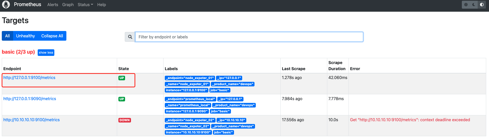

> 在 Alertmanager 中，原先的关于这个实例的告警就会消失，如图只剩下另外一个测试实例

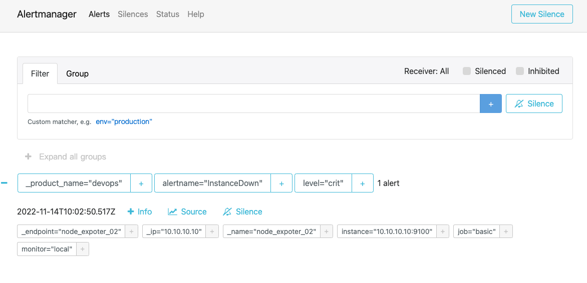

## Grafana

> 我们直接通过 brew 安装 Grafana，并且不做配置文件配置，按照默认方式直接启动服务

## 安装启动

```sh
brew install grafana
brew services start grafana
```

## 配置

### Datasource

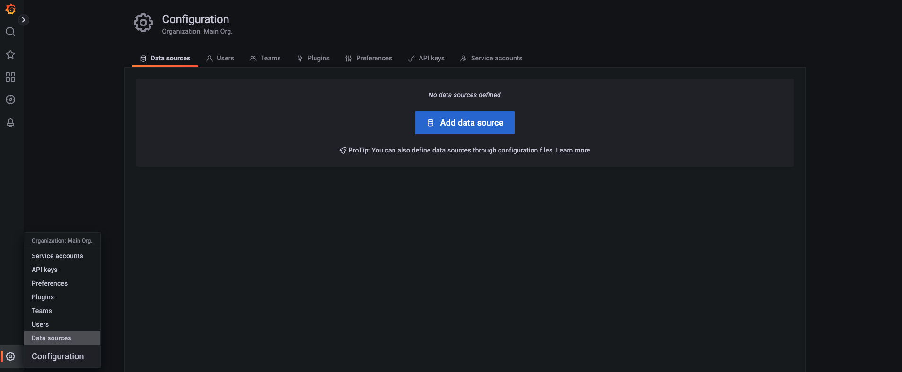

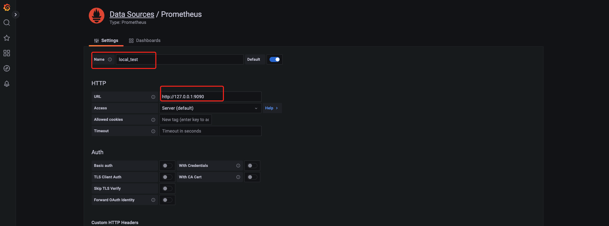

### Dashboards

> [1 Node Exporter for Prometheus Dashboard EN 20201010](https://grafana.com/grafana/dashboards/11074-node-exporter-for-prometheus-dashboard-en-v20201010/)

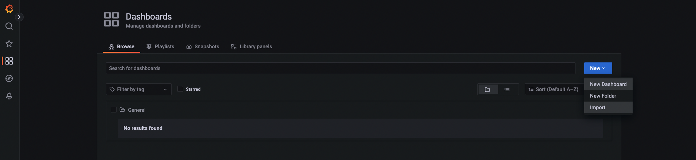

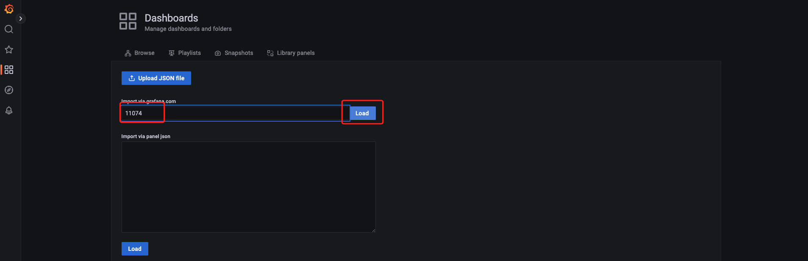

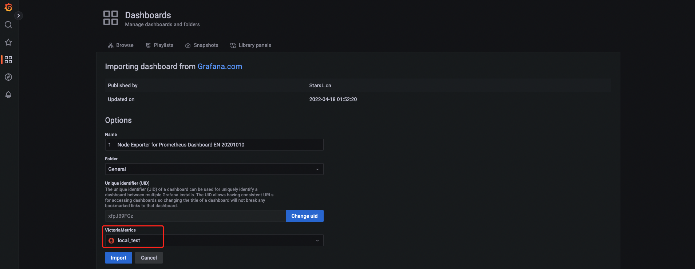

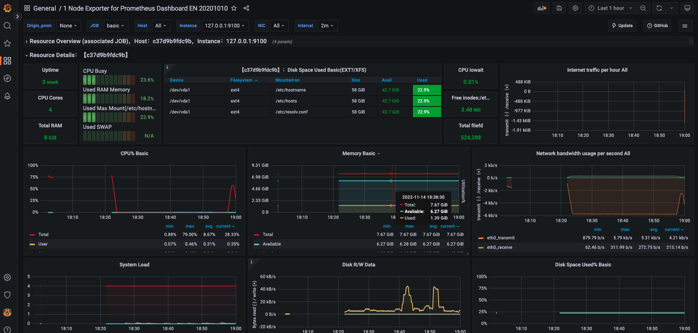