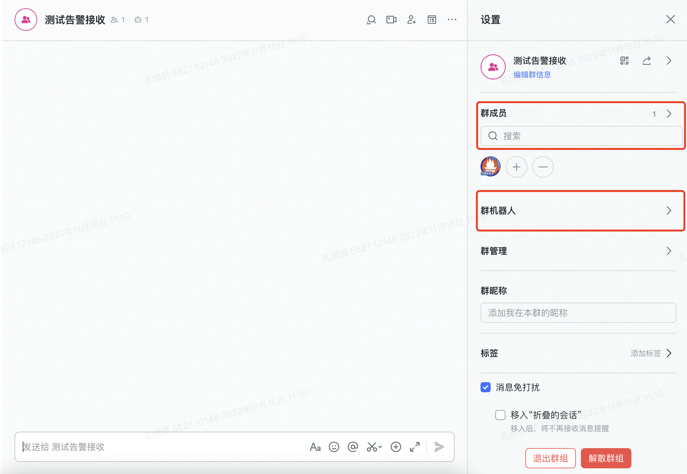
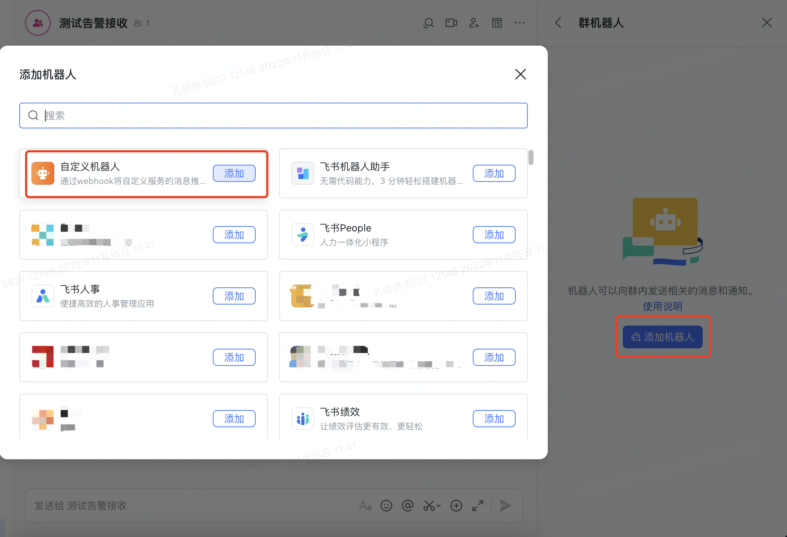
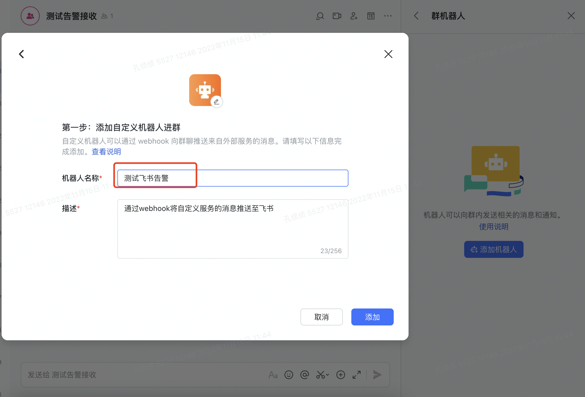
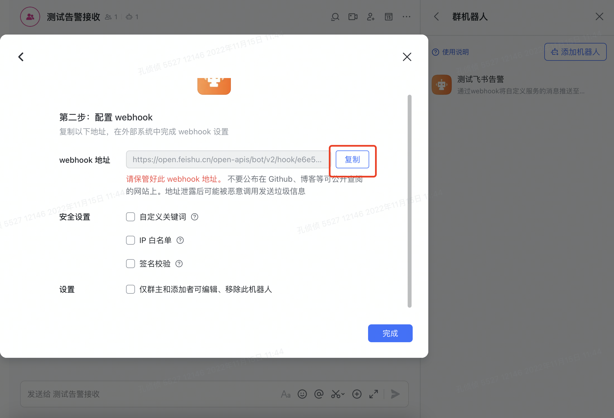
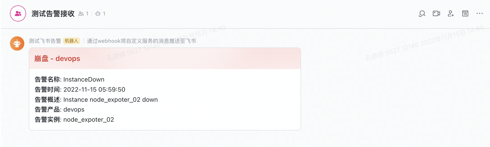
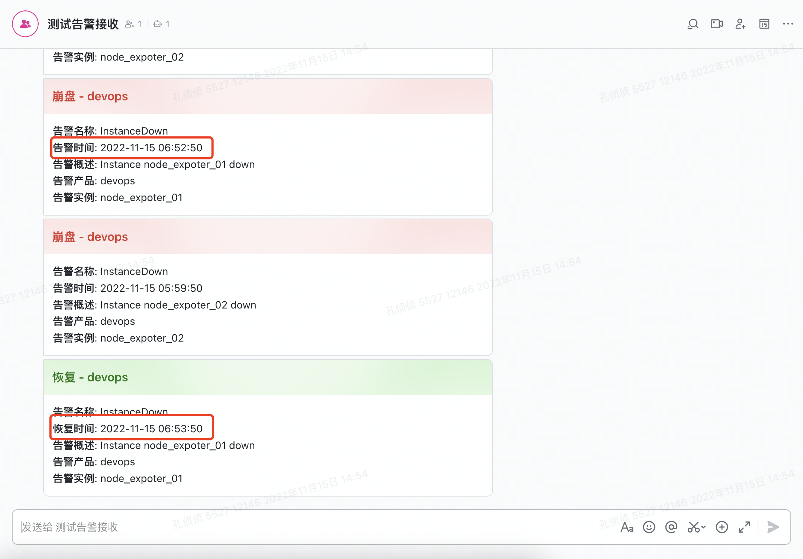

# 飞书告警实践

> 在上一篇中我们完整实践了整个 Prometheus 监控体系是怎么玩儿的，关于告警信息的发送我们只是简单的将告警信息打印在屏幕中，有了一个直观的了解，但是在真正的业务场景中，是需要将告警信息发送给具体的告警接收人的，所以这一篇，我们开发个简单的 webhook 服务，来将告警信息通过飞书的方式发送。

## 新建飞书 Robot

> 需要新建一个飞书群组

> 在飞书群组中新建一个飞书 Robot

> 拿到飞书 Robot 的 Webhook 地址，接下来的开发中会用到这个 Webhook 地址

## 开发一个 Webhook 服务

> 基于[飞书卡片模版](https://open.feishu.cn/tool/cardbuilder?from=howtoguide)，来开发 Webhook 服务

> 启动服务 go run main.go

::: details 点击查看代码
@[code](feishu_webhook.go)
:::

## 查看飞书告警信息

> 飞书群组接收到的告警信息如图

> 下面我们测试下告警恢复的消息，先把 node exporte 关闭再开启，这样就模拟了监控对象的离线和在线

## 结语

这里我们只是简单的实践了通过飞书的机器人来发送告警消息，还没有深入的开发。如：

- 告警消息很多的情况下，怎么发送告警信息，因为如果还是一条条发送的话，会面临告警风暴
- 不同的人需要接收到不同的告警消息，那么我们的后端服务就需要一个接收者列表，当发送消息的时候去请求指定的 Webhook 地址
- 飞书的消息卡片支持回调，当我们收到告警卡片信息的时候，可以有按钮点击设置当前告警的维护
