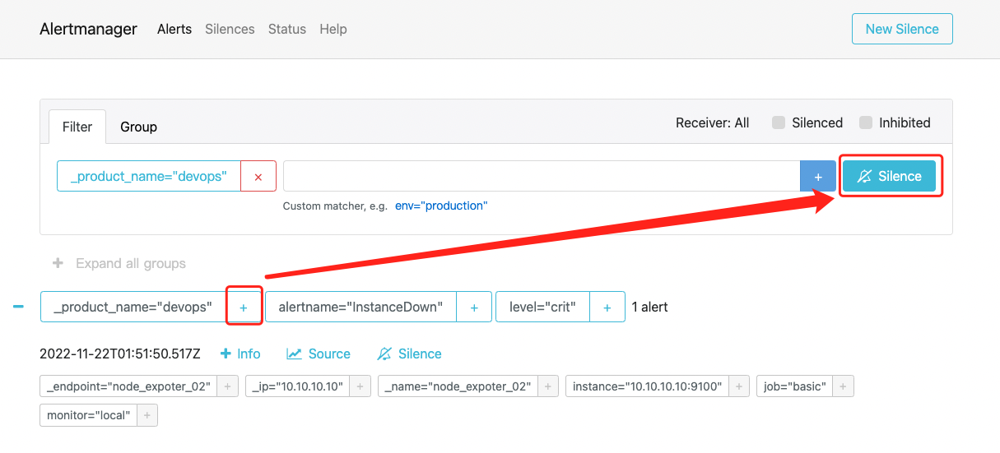
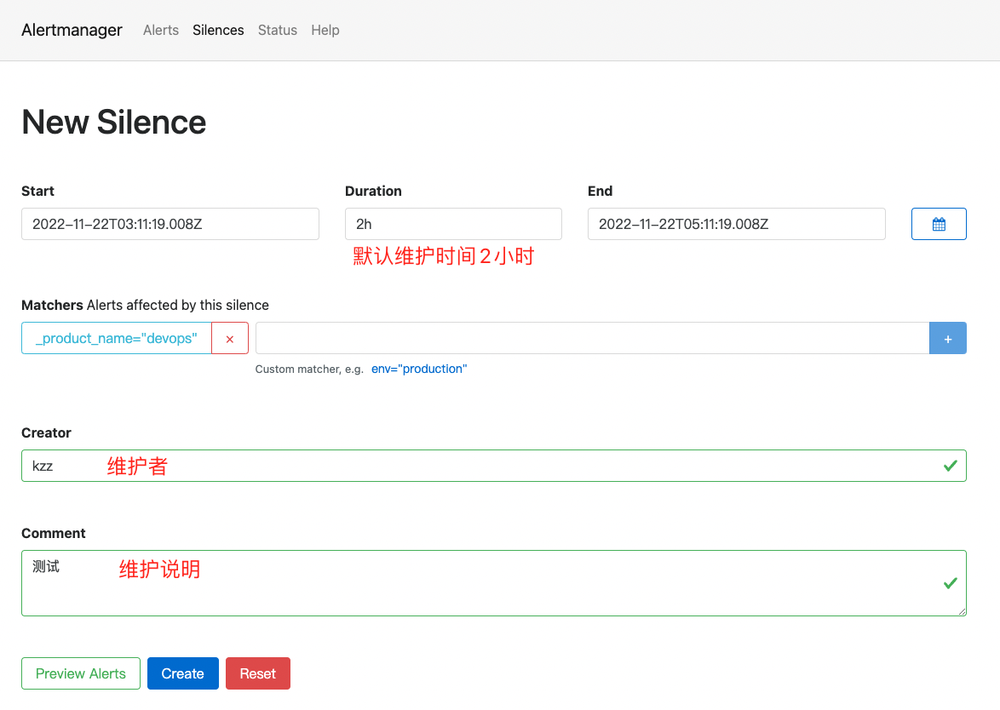
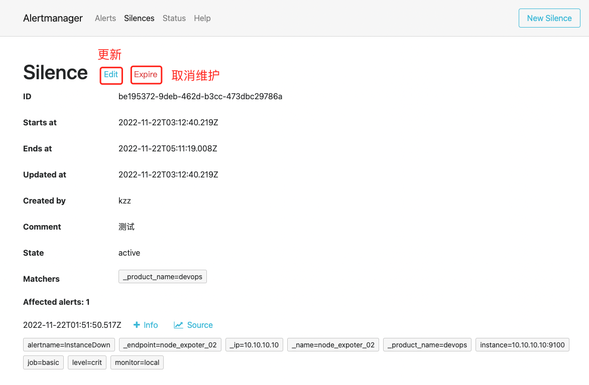
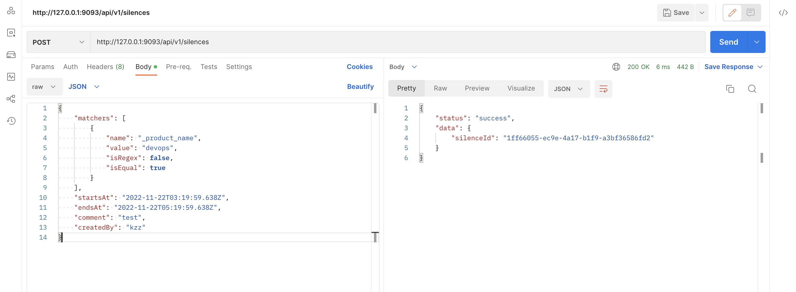
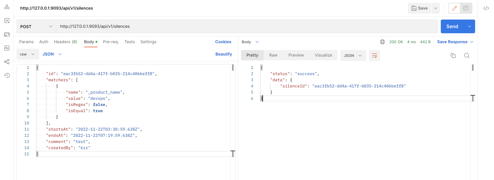

# 告警维护实践

> 告警维护在 Alertmanager 中属于比较好理解的功能，在我们的实际业务场景中，经常用来在游戏发版前设置维护，发版结束之后取消维护

## 原生 Web 操作

- 根据标签选择某些告警

- 新建的维护策略默认维护时间是 2 小时

- 新建的维护策略可以更新，可以设置过期(取消)

## API 操作

- 通过 API 操作新建维护策略，默认返回的是这个维护策略的 ID

- 当需要更新的时候，必须在 json 体中包含这个 ID

## 结语

- 当你在处理故障的时候，设置告警维护能避免打扰
- 当新增维护的时候，如果 Starttime 不指定，默认为当前时间
- Alertmanager 的 Silence 在新增或者更新的时候，注意 Starttime 和 Endtime 的格式为 RFC3339
- Alertmanager 的 Silence 配置中的 matchers 支持正则
