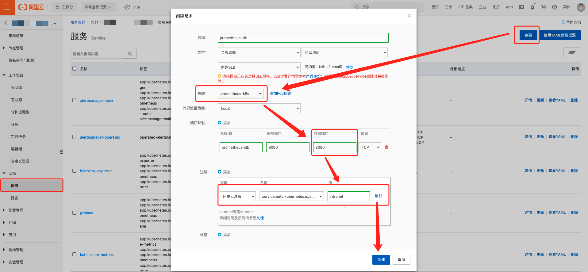
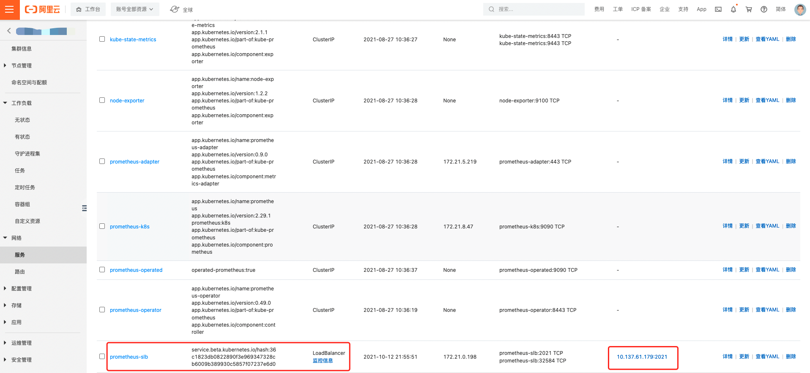
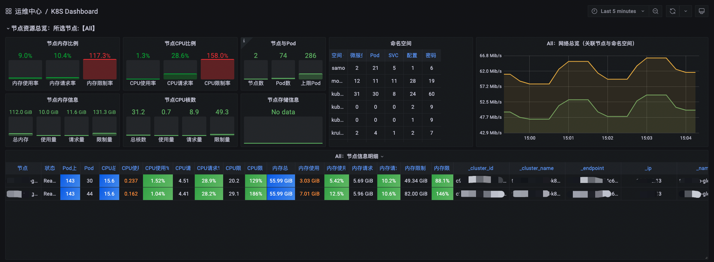

# K8S 监控实践

> 我们 K8S 监控是通过 [kube-prometheus
> ](https://github.com/prometheus-operator/kube-prometheus)来实现的

## kube-prometheus 的四种资源

> 在正式环境中，其实我们只需要 Prometheus 和 ServiceMonitor 资源，然后通过联邦的方式将数据读取到统一的 Prometheus 源中

- Prometheus

> 这个资源类型，用来管理 Prometheus Server 的 StatefulSets 资源

- ServiceMonitor

> 就是我们需要监控的动态服务，通过获取到 service 的 label 标签绑定到指定的 service，然后获取对应的 endpoint 资源的 metrics 路由，进而可以获取 pod 中的监控数据。Operator 会实时的 watch servicemonitor 资源的变化，自动更新/etc/prometheus/config_out/prometheus.env.yaml 配置文件，并对 prometheus-server 进行 reload 操作。

- Alertmanager

> 该 CRD 定义了在 Kubernetes 集群中运行的 Alertmanager 的配置，同样提供了多种配置，包括持久化存储。对于每个 Alertmanager 资源，Operator 都会在相同的命名空间中部署一个对应配置的 StatefulSet，Alertmanager Pods 被配置为包含一个名为 的 Secret，该 Secret 以 alertmanager.yaml 为 key 的方式保存使用的配置文件

- PrometheusRule

> 该 CRD 定义了我们需要监控告警的规则，有非常重要的一个属性 ruleSelector，用来匹配 rule 规则的过滤器，要求匹配具有 prometheus=k8s 和 role=alert-rules 标签的 PrometheusRule 资源对象。（其实就是把创建的 prometheusrule 资源聚合到 prometheus-k8s-rulefiles-0 这个 configmap 里面，然后挂载到 prometheus-server 的/etc/prometheus/rules/prometheus-k8s-rulefiles-0/这个路径下面）

## 集群配置

> 这里我们选择 kube-prometheus，默认安装之后，所有的组件都会安装上，但是里边的 alertmanger 和 grafana 我们其实是不需要的，这个可以根据情况不安装或者安装之后卸载删除掉。

```sh
git clone https://github.com/prometheus-operator/kube-prometheus.git
cd kube-prometheus/manifests
kubectl apply -f .
```

```sh
[ ~]# kubectl -n monitoring get statefulset
NAME                READY   AGE
alertmanager-main   3/3     13d # 这个可以自行卸载
prometheus-k8s      2/2     13d
```

> 当安装好 kube-prometheus 之后，我们使用的就是安装好的 Prometheus 组件，下面将 Prometheus 暴露出来，通过 federate 的方式，让外部的 Prometheus 来抓取集群内的 Prometheus 监控信息





## Prometheus 配置

> 接下来我们就可以在我们自己的 Prometheus 中联邦集群里新建的 Prometheus，只需要新加个 Job 任务就好

```yaml
scrape_configs:
  - job_name: k8s_cluster_job
    params:
      match[]:
        - '{job=~".*"}'
    scrape_interval: 60s
    scrape_timeout: 50s
    metrics_path: /federate
    scheme: http
    static_configs:
      - targets:
          - "svc(slb)_addr"
```

至此，我们的 K8S 集群基础监控就已经接入完成了，效果如图



## K8S 的 Pod 监控

> [参考文档](https://github.com/prometheus-operator/prometheus-operator/blob/main/Documentation/additional-scrape-config.md)

> 当我们通过 kube-prometheus 来做集群监控的时候，默认 Pod 的监控应该是有的，查看方式

```sh
kubectl get secret prometheus-k8s -n monitoring -o json | jq -r '.data. "prometheus.yaml.gz"'| base64 -d | gzip -d
# kubernetes-pods中 有没有配置 **__meta_kubernetes_pod_annotation_prometheus_io_scrape** 相关配置
```

### Pod 监控配置

> 如果 kube-prometheus 来做集群监控的时候，默认 Pod 的监控任务没有，我们新增一下

- 新编辑文件 prometheus-additional.yaml

```yml
- job_name: "kubernetes-pods"
  kubernetes_sd_configs:
    - role: pod
  relabel_configs:
    - source_labels: [__meta_kubernetes_namespace]
      action: replace
      target_label: kubernetes_namespace
    - source_labels: [__meta_kubernetes_pod_name]
      action: replace
      target_label: kubernetes_pod_name
    - action: labelmap
      regex: __meta_kubernetes_pod_label_(.+)
    - source_labels: [__meta_kubernetes_pod_annotation_prometheus_io_scrape]
      action: keep
      regex: true
    - source_labels: [__meta_kubernetes_pod_annotation_prometheus_io_path]
      action: replace
      target_label: __metrics_path__
      regex: (.+)
    - source_labels:
        [__address__, __meta_kubernetes_pod_annotation_prometheus_io_port]
      action: replace
      regex: ([^:]+)(?::\d+)?;(\d+)
      replacement: $1:$2
      target_label: __address__
    - source_labels: [__address__]
      separator: ;
      regex: ".*:(.*)"
      target_label: __pod_port__
      replacement: $1
      action: replace
```

- 新增 Secret

```sh
kubectl -n monitoring create secret generic additional-scrape-configs --from-file=prometheus-additional.yaml
```

- 修改 Prometheus

```yaml
---
spec:
  additionalScrapeConfigs:
    key: prometheus-additional.yaml
    name: additional-scrape-configs
```

- 至此我们自定义 Pod 的监控就完成了

## K8S 告警规则

- [官方配置](https://github.com/prometheus-operator/kube-prometheus/blob/03b36af546/manifests/prometheus-rules.yaml)

- [Awesome Prometheus alerts](https://awesome-prometheus-alerts.grep.to/rules.html#docker-containers)
