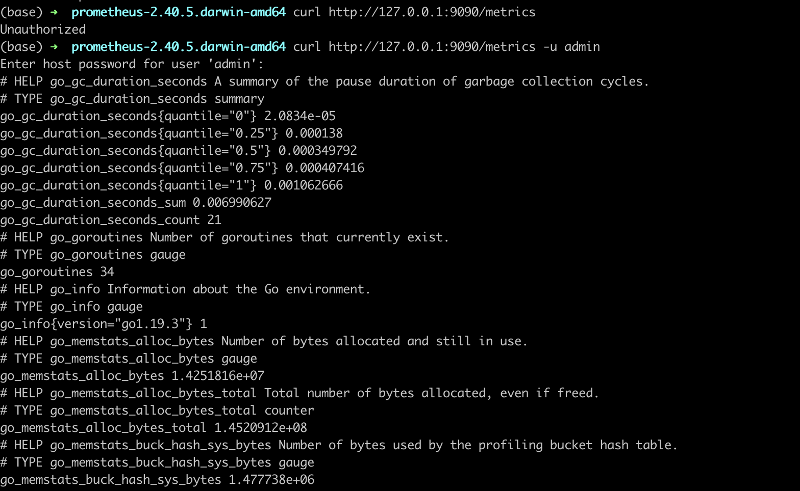

# Prometheus 的认证

Prometheus 其实有三种认证方式，我们实践的是基础认证，也就是 username 和 password 方式的 basic auth

## 认证文件

新建 web.yml 文件

其中我们设定用户名和密码都是 admin

不过密码需要加密，方式如：

```py
import bcrypt
password = "admin"
hashed_password = bcrypt.hashpw(password.encode("utf-8"), bcrypt.gensalt())
print(hashed_password.decode())
```

web.yml

```yml
basic_auth_users:
  admin: $2b$12$9xjGU51fYohVBrUHnH4n/ed8Mid4qbSGonIQ1KdlEGNtimRqIFk7K # 密码是上面方式生成
```

## 配置

我们稍微修改下基础配置文件

```yml
# 全局配置
global:
  scrape_interval: 15s
  scrape_timeout: 15s

alerting:
  alertmanagers:
    - static_configs:
        - targets:
#            - 127.0.0.1:9093

rule_files:

scrape_configs:
  - job_name: "local_prom"
    static_configs:
      - targets: ["127.0.0.1:9090"]
    basic_auth:
      username: admin
      password: admin
```

## 启动服务

```sh
./prometheus \
--config.file="prometheus.yml" \
--web.config.file="web.yml" \
--web.listen-address="0.0.0.0:9090" \
--web.enable-lifecycle \
--log.level=debug
```

## 测试

如果没有认证的话，直接 curl 本机的 Prometheus 服务的 metrics 是直接返回信息的

现在加上认证的话，就需要指定用户名和密码了


