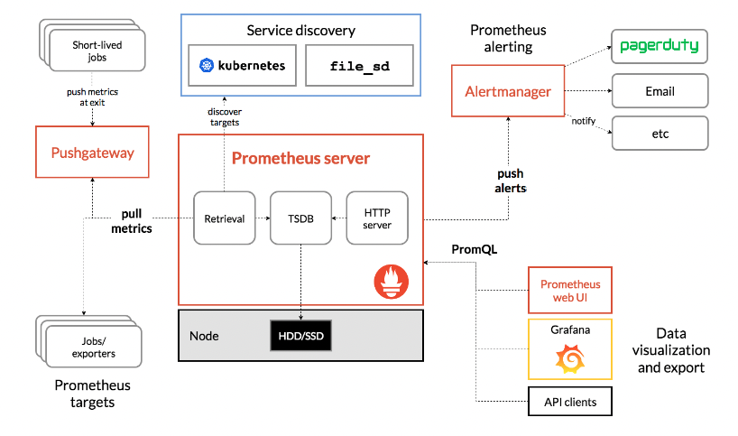

# Prometheus 基础

> 随着云原生的到来，Prometheus 基本上是作为唯一可选的监控方案，
> zabbix 出生的比较早，容器技术都还没诞生，自然对容器的支持较弱，
> open falcon 虽然提供了容器的监控，但是支持力度有限，大多厂商都会要二次开发，
> 总体上看 Prometheus 基本就是目前监控领域的最好的“瑞士军刀”了

## 基础

> 当然最好的 Prometheus 基础就是去看[官方文档](https://prometheus.io/docs/prometheus/latest/getting_started/)

## 架构



- Prometheus 是主动拉取的，而不是被动上报的
- Prometheus 的核心是一个时序性数据库，存储多维度的数据模型
- PromQL 提供一种多维度的灵活查询语言，来查询你想要的数据

## Metrics 数据模型

Prometheus 中存储的数据是时序性的，是由 metric 名称和一系列的标签(键值对儿)组成

- metric

> 这个名称应该是可读的具有意义的，如: http_requests_total，表示 http 的请求的总数

- 标签

> 使得同一个 metric 指标有了不同的维度，如: http_requests_total{method="GET"}，表示所有 http 请求中的 GET 请求

- 样本

> 每一个时序数据，包括 metric 指标名称，零个或者一个或者多个标签，一个 float64 位的值，一个毫秒级别的时间戳

```
<metric_name>{<label_name>=<label_value>, ...} float64_value millisecond-precision_timestamp
```

## Metrics 类型

- Counter

  - 递增的计数器
  - 数值只能在重新启动的时候增加或者重置为 0
  - 可以用来表示应用服务的请求数等

- Guage

  - 可增可减的仪表盘，可以用于反应应用服务的当前状态
  - 可以用来表示当前内存的使用情况，并发请求的数量等

- Histogram

  - 自带 buckets 区间用于统计分布统计图
  - 主要用于在指定分布范围内(Buckets)记录大小或者事件发生的次数

- Summary
  - 类似上述的 Histogram，都可以统计时间发生的次数和大小
