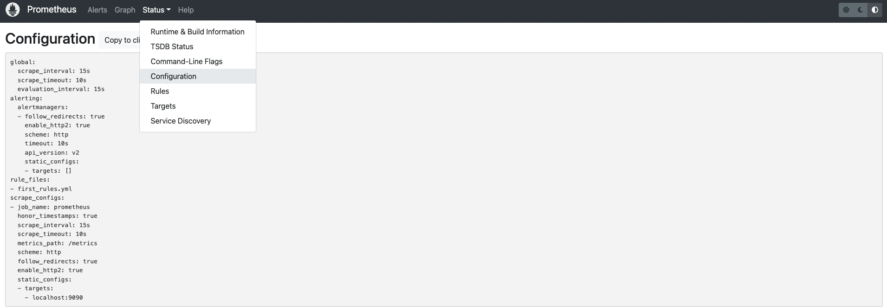

# Prometheus 初体验

## 下载

下载：[Download the latest release](https://prometheus.io/download/)

```sh
tar xvf prometheus-2.40.1.darwin-arm64.tar.gz
cd prometheus-2.40.1.darwin-arm64
```

## 配置文件

> 以下是 Prometheus 的默认配置文件，Prometheus 启动的时候如果不指定配置文件参数，就默认用当前目录下的默认配置文件

```yml
# 全局配置
global:
  scrape_interval: 15s # 任务抓取周期, 每隔多少秒去各个被监控端点拉取一次指标数据
  scrape_timeout: 50s # 任务抓取超时时间
  evaluation_interval: 15s # 计算周期, 主要针对下面的告警规则, 每隔多少秒执行一次表达式判断告警规则
  external_labels:
    monitor: "shanghai_1" # 此Prometheus的标识, 会在metric里添加这对标签
  query_log_file: "./query_log.log" # 记录PromQL查询日志

# 告警配置
alerting:
  alertmanagers:
    - static_configs:
        - targets:
            - alertmanager:9093 # Alertmanager的服务端

# 告警规则配置
rule_files:
  # - "first_rules.yml" # 告警规则的配置文件
  # - "second_rules.yml"

# 抓取配置
scrape_configs:
  - job_name: "prometheus" # 抓取任务的任务名称
    static_configs:
      - targets: ["localhost:9090"] # 抓取任务的下面的目标实例
```

在 Prometheus 体现如图



## 检查配置

```sh
cd prometheus-2.40.1.darwin-arm64
./promtool check config prometheus.yml
```

## 运行

### 直接运行

```sh
cd prometheus-2.40.1.darwin-arm64
./prometheus
```

这样就直接按照默认参数运行了 Prometheus 服务，读取的配置文件就是当前目录下的 prometheus.yml 默认配置文件

## 启动参数

> 列举一些常用的

- --config.file="prometheus.yml" # 制定配置文件
- --web.listen-address="0.0.0.0:9090" # Prometheus 的 UI 地址
- --web.enable-lifecycle # 允许通过 HTTP 请求来关闭和重启 Prometheus 服务
- --storage.tsdb.path="data/" # metrics 信息存储路径
- --storage.tsdb.retention.time=15d # metrics 样本存储时长
- --storage.tsdb.retention.size=512MB # 每个 blocks 的大小

### 参数运行

```sh
./prometheus --config.file="prometheus.yml" \
--web.listen-address="0.0.0.0:9090" \
--web.enable-lifecycle \
--storage.tsdb.retention.time=15d \
--storage.tsdb.retention.size=512MB
```
