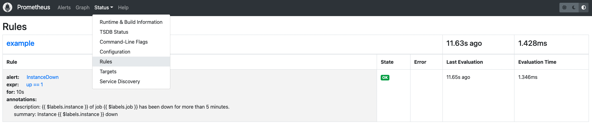
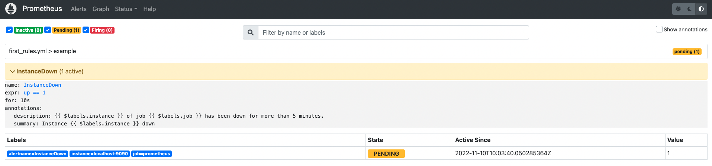
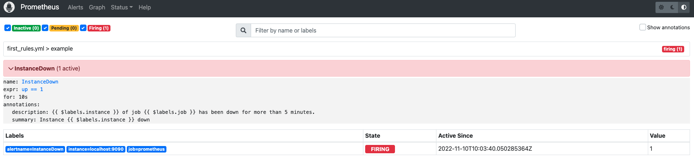
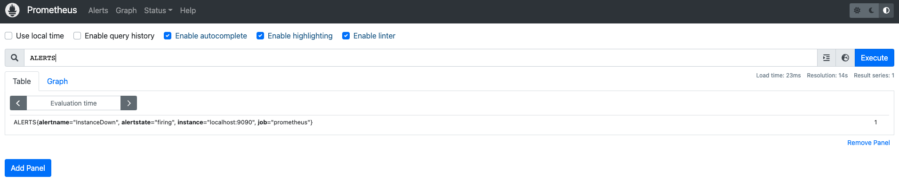

# 告警规则

> 在 Prometheus 配置有三大块配置，全局配置、告警规则配置、抓取任务配置

> 其中告警规则配置在 Prometheus 配置中属于重要的一块

## 示例

first_rules.yml

```yml
groups:
  - name: example # 这一组的告警规则名称
    rules:
      # 这条告警规则的意思是目标实例已经持续5分钟离线了(0 代表离线 1 代表在线)
      - alert: InstanceDown # 告警名称
        expr: up == 1 # PromQL表达式
        for: 5m # 持续时间
        labels: # 允许附加到告警上的一组标签
          severity: page
        annotations:
          summary: "Instance {{ $labels.instance }} down" # 告警概述
          description: "{{ $labels.instance }} of job {{ $labels.job }} has been down for more than 5 minutes." # 告警描述(更加详细)
```

在 Prometheus 中体现如图



## 检查配置

```sh
cd prometheus-2.40.1.darwin-arm64
./promtool check rules first_rules.yml
```

## 告警状态

> 这里的告警状态是 Prometheus 侧的，在 Prometheus 体系中，真正发送告警信息是 Alertmanager 接管的

- inactive 非活动状态，表示正在监控，但是还未有任何警报触发

- pending 告警已经触发，但是还需要等待 For 时间，才会将告警状态转换为 firing



- firing 真正的告警，将告警发送给 Alertmanager



## 查看告警

在 Prometheus UI 中


