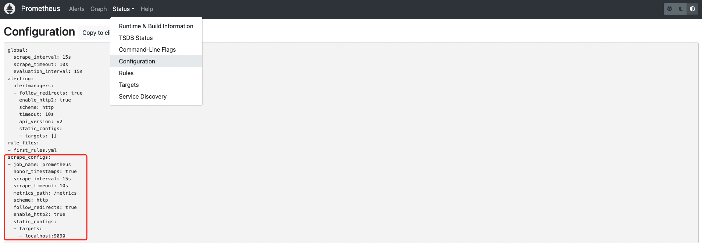

# 监控(抓取)任务

> 在 Prometheus 配置有三大块配置，全局配置、告警规则配置、抓取任务配置

> 其中监控抓取配置在 Prometheus 配置中也属于重要的一块

## 任务配置

先来看下默认配置文件中的抓取任务

```yml
scrape_configs:
  # The job name is added as a label `job=<job_name>` to any timeseries scraped from this config.
  - job_name: "prometheus"

    # metrics_path defaults to '/metrics'
    # scheme defaults to 'http'.

    static_configs:
      - targets: ["localhost:9090"]
```

在 Prometheus 中体现如图



再来看下官方关于抓取任务的配置

```yml
scrape_configs:
  - job_name: # 抓取任务的任务名称
    scrape_interval: 15 # 默认是全局配置中scrape_interval的值
    scrape_timeout: 10 # 默认是全局配置中scrape_timeout的值
    metrics_path: /metrics # 目标暴露metrics信息的HTTP路径
    scheme: http # 请求协议，默认是http
    params: [<string>: [<string>, ...]] # 可选的HTTP中URL的参数
    static_configs: # 静态配置
      targets: [- '<host>'] # 抓取目标列表
      labels: [<labelname>: <labelvalue> ...] # 抓取目标实例配置的标签
```

## 服务发现

> 列举常用的几个

- [file_sd_config](https://prometheus.io/docs/prometheus/latest/configuration/configuration/#file_sd_config)
  - 基于文件的服务发现
  - 文件提供 json 和 yaml 两种格式

例子

```yml
scrape_configs:
  - file_sd_configs:
      - files:
          - instances.yml # 文件名称
        refresh_interval: 10s # 自动刷新时间
    job_name: basic_instances # 抓取任务的任务名称
    metrics_path: /metrics
    scheme: http
    scrape_interval: 60s # 这里配置的是60s，可以覆盖全局配置中的值
    scrape_timeout: 50s # 这里配置的50s，可以覆盖全局配置中的值
```

- [dockerswarm_sd_config](https://prometheus.io/docs/prometheus/latest/configuration/configuration/#dockerswarm_sd_config)

  - 基于 Docker Swarm 引擎的服务发现
  - 服务发现的目标角色有三种：services、tasks、nodes

例子

```yml
- job_name: docker_swarm_nodes
    dockerswarm_sd_configs:
      - host: tcp://x.x.x.x:2375
        role: nodes
    relabel_configs:
      - source_labels: [__meta_dockerswarm_node_address]
        target_label: __address__
        replacement: $1:9100
      - source_labels: [__meta_dockerswarm_node_hostname]
        target_label: instance
```

- [kubernetes_sd_config](https://prometheus.io/docs/prometheus/latest/configuration/configuration/#kubernetes_sd_config)

  - 基于 K8S 的服务发现
  - 发现的角色有：node、service、pod、endpoints、endpointslice、ingress

例子

```yml
- job_name: "kubernetes-pods"
  kubernetes_sd_configs:
    - role: pod
  relabel_configs:
    - source_labels: [__meta_kubernetes_namespace]
      action: replace
      target_label: kubernetes_namespace
    - source_labels: [__meta_kubernetes_pod_name]
      action: replace
      target_label: kubernetes_pod_name
    - action: labelmap
      regex: __meta_kubernetes_pod_label_(.+)
    - source_labels: [__meta_kubernetes_pod_annotation_prometheus_io_scrape]
      action: keep
      regex: true
    - source_labels: [__meta_kubernetes_pod_annotation_prometheus_io_path]
      action: replace
      target_label: __metrics_path__
      regex: (.+)
    - source_labels:
        [__address__, __meta_kubernetes_pod_annotation_prometheus_io_port]
      action: replace
      regex: ([^:]+)(?::\d+)?;(\d+)
      replacement: $1:$2
      target_label: __address__
    - source_labels: [__address__]
      separator: ;
      regex: ".*:(.*)"
      target_label: __pod_port__
      replacement: $1
      action: replace
```
