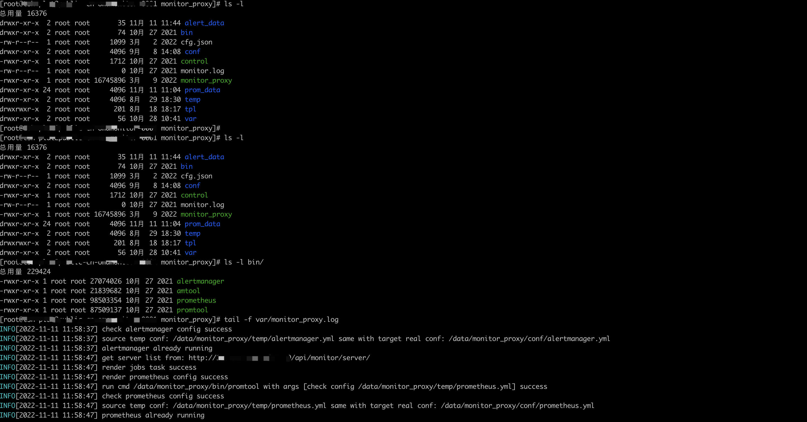

# Prometheus 模版示例

启动 Prometheus 主要是配置文件需要配置好，包括告警规则的配置，监控任务的配置，监控实例的配置

所以我们后端服务需要有这些接口，通过请求后端服务的接口，读取数据并渲染好 Prometheus 配置文件

## 告警规则模版

```tpl
groups:
  - name: {{ .AlertRuleName }}
    rules:
    {{- range .Rules }}
      - alert: {{ .AlertName }}
        expr: {{ .Expr }}
        for: {{ .For }}
        labels:
          level: {{ .Labels.Level }}
        annotations:
          summary: {{ .Annotations.Summary }}
          description: {{ .Annotations.Description }}
    {{- end }}
```

## 监控实例模版

```tpl
# 实例列表(标签)
{{- range .Instances }}
- labels:
    _ip: {{ .IP }}
    _name: {{ .Name }}
    _endpoint: {{ .Endpoint }}
    {{- range $key, $value := .Labels }}
    {{ $key }}: {{ $value }}
    {{- end }}
  targets:
    - {{ .IP }}:{{ .Port }}
{{- end }}
```

## Prometheus 配置文件模版

```tpl
# 全局配置
global:
  scrape_interval: {{ .GlobalScrapeInterval }}s
  evaluation_interval: {{ .GlobalEvaluationInterval }}s
  scrape_timeout: {{ .ScrapeTimeout }}s
  external_labels:
    {{- range $key, $value := .Labels }}
    {{ $key }}: {{ $value }}
    {{- end }}

# 告警alertmanager配置
alerting:
  alertmanagers:
    - static_configs:
        - targets:
            - {{ .AlertmanagerAddr }}
# 告警规则文件
rule_files:
  - {{ .AlertRuleName }}.yml

# 抓取任务配置
scrape_configs:
  {{- range .Tasks }}
  - file_sd_configs:
      - files:
          - {{ .TaskID }}.yml
        refresh_interval: 10s
    job_name: {{ .Name }}
    metrics_path: {{ .Metric }}
    params:
    {{- range $key, $value := .Params }}
      {{ $key }}: {{ $value | printf "%q"}}
    {{- end }}
    scheme: {{ .Scheme }}
    scrape_interval: {{ .Interval }}s
    scrape_timeout: {{ .Timeout }}s
    {{ end }}
```

## Prometheus 的二次封装

- 程序读取后端服务接口数据，渲染配置文件
- 程序启动本地 Prometheus 的二进制文件服务(加上参数)
- 程序定时检查服务运行情况，定时读取配置文件并渲染，如果有变化执行 reload 重载


