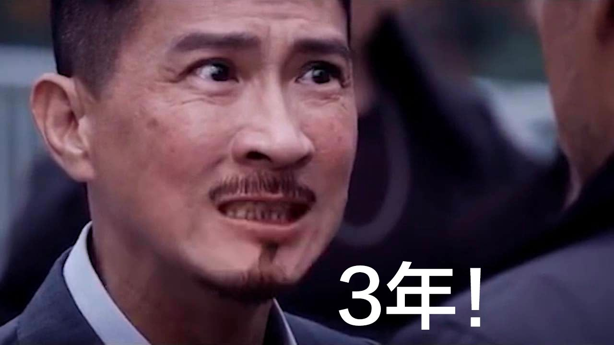

# 2022 年生活

> 年度感受就是，身体很重要，保险很重要，钱很重要

## 疫情

封城

我们封了将近一个季度，回想起来没啥好回忆的，无聊透了

人性的恶看的是真真切切，有意思多了，我说这话的意思是没有波及到我自身，如果波及到我自身，可能不会这样讲

囤货

家里有女人的好处就是会帮你把一切都想的很坏，然后囤一切能用的能吃的东西

封闭期间，我们家里甚至给小区提供了几天的食品（馒头、面包、饺子、蛋糕等）

甚至楼栋里的租户来我家要吃的，因为他实在是没有了，速食没有了，也没有做饭的厨具之类的，只能这样，你能想象吗

核酸

封城期间没完没了的核酸，部分人是做核酸的过程中感染的，不过我们小区整体还不错，感染的很少

放开

我们终于在 12 月份开放了，可是作为个人的主观感受就是很突然，就像网上讲的，前一秒 ICU 后一秒就 KTV

仿佛我们之前的封控是开玩笑一般

然后就又是一波儿疯抢物资，特别是药，仿佛都在等着感染

## 出行

杭州

夏季出行游玩确实是适合的季节

杭州真的很适合我这种北方人，悠闲，青春，活力

年度出行因为所谓的疫情原因，仅此一次

每当我看到抖音上的远方，那大山大河，好想去啊

回家

老妈国庆节带着儿子回了趟老家，这之前的一周因为我的沟通的缘故，导致了大吵一场

## 看病

咳嗽发烧

小朋友病毒性发烧咳嗽，一整年下来有那么两三次，也还算正常

我们大人今年倒没怎么发烧咳嗽，就有一次是急性的，吃完烩面之后突然发烧，检查也是病毒性的

牙齿

牙齿疼起来似乎确实要命，虽然我没有，但是我看到那种疼的表情和表现，如感同身受

老婆彻底的拔了智齿和坏牙，还要补种，花费可能是三四万

我的也发现了有三颗将要坏的，都是牙根那边，尽早安排了补上

手术

老妈做了一个泪囊炎的小手术，前后住院不到一周，花费三万多，医保报销了将近两万，蛮好

人在手术之后是真的虚弱，所以人到中年，越发体会到健康的身体才是本钱

脖子

今年脖子落枕或者疼痛的次数明显上升了，确实锻炼身体的次数少

## 养娃

今年下半年开始竟然已经学会了将近十首古诗

小朋友的记忆力是真的好，不过也得益于五言诗的韵律

另外绘本找东西，也是找过一遍之后，后面再来看，全部都记住了

## 保险

车险没啥说的

家里人我都给配置了保险
