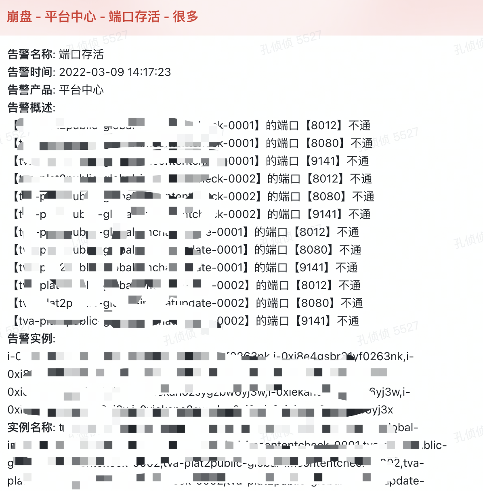

# 监控平台

## BUG

- 客户端需要支持类似pushgateway的功能
- 告警信息的聚合 同一个告警项 超过5条类似的就合并成一条
- 告警维护silence 不唯一 导致Alertmanager里只有一条silence生效 严重bug

## Alertmanager过期的silence删除问题

- 默认情况下过期的silence超过5天(--data.retention=120h)就会自动gc回收掉
- 所以在我们的配置中保留默认的值
- 后续考虑在配置文件中设置成变量
- 之所以这样的默认配置是为了在事后分析确定的告警信息为啥没发送, 是否是重新建了一个silence导致的