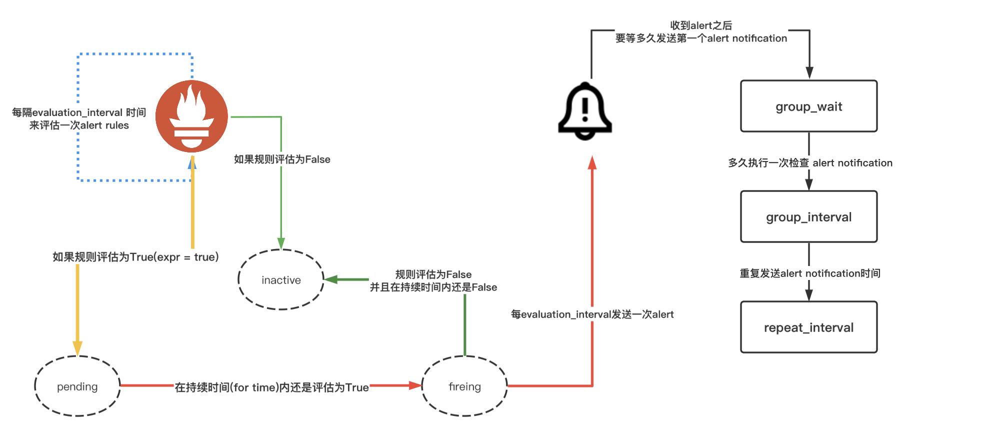

# Alertmanager告警系统

> 在监控体系中，告警系统是比不可少的一块，也是复杂难搞的部分。比如你可能会有如下对话

- 这个又不是我负责的业务，为啥这个告警信息要发给我啊
- 这个告警信息能不能发给多个业务组的人员，他们也需要
- 你们这个监控系统，我收到的告警也太多了吧，没法儿看
- 这个告警的阈值可不可以让我来配置，现在的是统一的吗
- 我想收到同样的告警3次之后，才让客服给我打电话处理
- 我想在告警信息里点击一下，快速给这个告警进行短时维护
- 等等其他的声音

> 由此，我们需要的告警系统至少要满足以下条件

- 不同的告警要发给不同的人或者人员分组
- 同样的告警可能需要发给不同的人或者人员分组
- 告警收到的频次可能需要业务方自定义调整
- 不能让用户一下子收到成百上千条告警信息
- 收到告警信息的渠道可能会多个，如微信、钉钉、飞书、手机短信等
- 不同等级的告警信息可能需要通知到不同的渠道
- 等我想一下其他的条件

> 由此，我们引来了我们自建监控系统中的告警组件-Alertmanager。

## 一条正常的告警规则

> 这条告警规则的意思是：如果目标失联持续时间是2分钟，就产生告警。这里最重要的是for，这个参数就是用来降噪的，比如网络有波动，那么你的目标就会有瞬间的失联存在。

```yaml
groups:
  - name: GlobalAlertRules # 告警规则组的名称
    rules:
      - alert: 目标失联 # 告警规则名称
        expr: up{} == 0 # PromQL的表达式，计算是否满足触发条件
        for: 2m # 满足触发条件，持续时间
        labels: # 自定义标签
          level: crit
        annotations: # 告警的描述信息
          description: 目标失联
          value: {{ $value }}
          summary: 目标 {{ $labels.job }} 失联
```

## 检查告警规则格式是否正确

```sh
./bin/promtool check rules conf/global_rules.yml

Checking conf/global_rules.yml
  SUCCESS: 1 rules found
```

## 一条告警走的路



## 告警的三种状态

> 一条告警的触发，首先的状态是Pending，然后再转换为Firing，这里会有For周期才会触发告警条件。如果没有配置for时间条件，则会直接从Inactive转到Firing状态。

| 状态     | 描述                                                          |
| -------- | ------------------------------------------------------------- |
| Inactive | 正常状态，未触发告警                                          |
| Pending  | 即将触发告警，但还未满足发送时间条件，就是规则中for的时间条件 |
| Firing   | 触发告警，已经满足发送时间条件，就是规则中for的时间条件       |

## 关于告警时间的参数

> 关于告警时间的参数官方有个[issue](https://github.com/prometheus/alertmanager/issues/2647)可以参考。

| 参数            | 描述                                                                           |
| --------------- | ------------------------------------------------------------------------------ |
| group_wait      | Alertmanager在收到一条新的告警时，在将这条告警发送给receiver之前需要等待的时间 |
| group_interval  | 对于一条已经出现过的告警，Alertmanager会每个多久再检查一次                     |
| repeat_interval | 对于一条已经出现过的告警，Alertmanager会多久重新发送给receiver                 |
