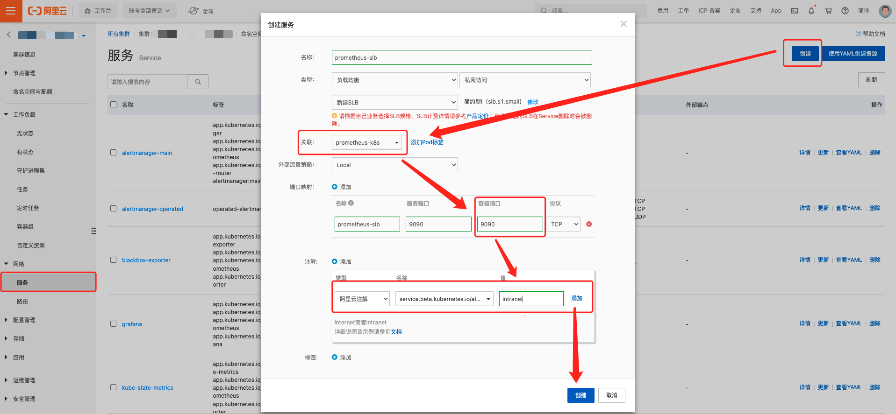
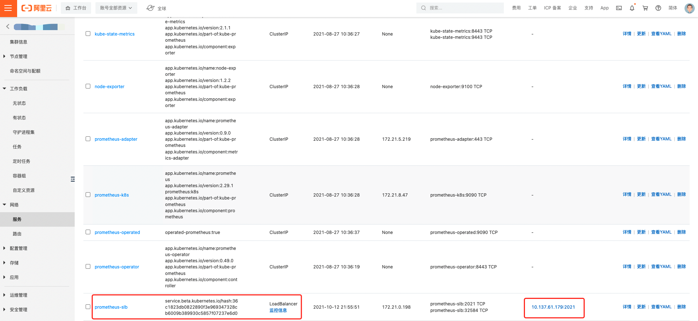
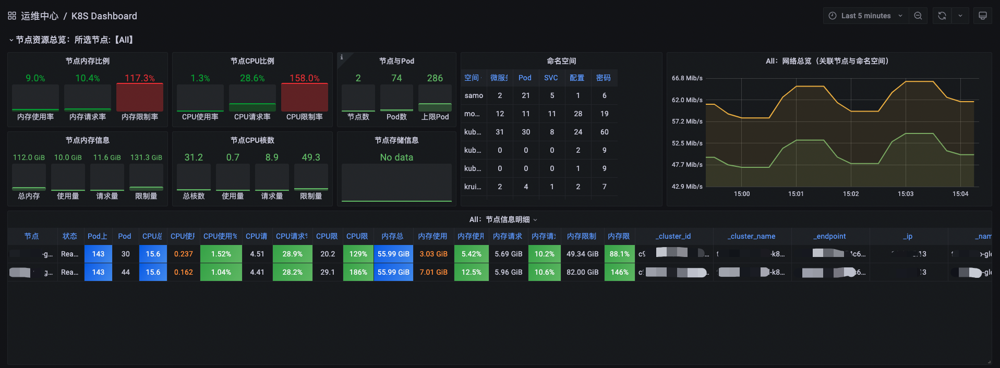
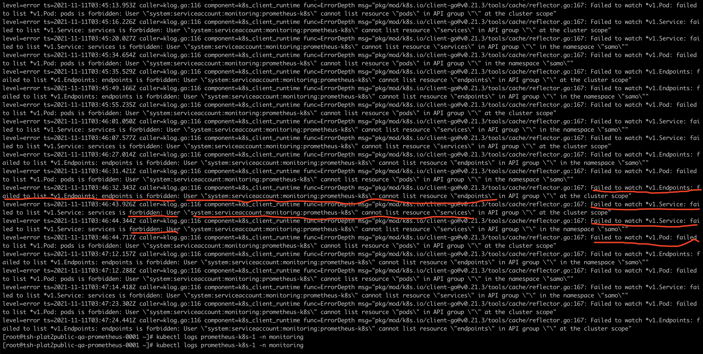
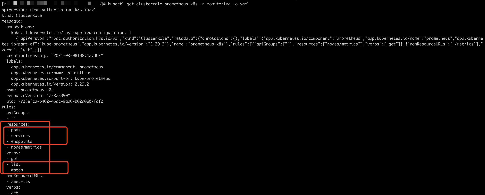

# kubernetes监控

> 在[游戏运维监控](./监控概述.md)中我们说到了需要监控的对象，那么在游戏运行环境中，肯定会有平台类的业务，这些业务目前大都运行在K8S集群里边，所以针对K8S的监控就显得必不可少

## K8S要监控什么

- 集群的监控

> 集群资源的使用情况，使用的够充分吗？还剩多少资源可用？

> 是否有足够的节点资源可以用于应用程度？多久会耗尽？

- deployment，pod的监控

> pod是否正常创建并运行？pod的请求和限制资源情况？

- 应用程序的监控

> 应用程序是否正常运行并响应？应用程序自身的监控指标？

## 部署

> 这里我们选择kube-prometheus，默认安装之后，所有的组件都会安装上，但是里边的alertmanger和grafana我们其实是不需要的，这个可以根据情况不安装或者安装之后卸载删除掉。

```sh
git clone https://github.com/prometheus-operator/kube-prometheus.git
cd kube-prometheus/manifests
kubectl apply -f .
```

```sh
[ ~]# kubectl -n monitoring get statefulset
NAME                READY   AGE
alertmanager-main   3/3     13d # 这个可以自行删除掉
prometheus-k8s      2/2     13d
```

## kube-prometheus的四种资源

> 在正式环境中，其实我们只需要Prometheus和ServiceMonitor资源，然后通过联邦的方式将数据读取到统一的prometheus源中

- Prometheus

> 这个资源类型，用来管理Prometheus Server的StatefulSets资源

- ServiceMonitor

> 就是我们需要监控的动态服务，通过获取到service的label标签绑定到指定的service，然后获取对应的endpoint资源的metrics路由，进而可以获取pod中的监控数据。Operator会实时的watch servicemonitor资源的变化，自动更新/etc/prometheus/config_out/prometheus.env.yaml配置文件，并对prometheus-server进行reload操作。

- Alertmanager

> 该 CRD 定义了在 Kubernetes 集群中运行的 Alertmanager 的配置，同样提供了多种配置，包括持久化存储。对于每个 Alertmanager 资源，Operator 都会在相同的命名空间中部署一个对应配置的 StatefulSet，Alertmanager Pods 被配置为包含一个名为  的 Secret，该 Secret 以 alertmanager.yaml 为 key 的方式保存使用的配置文件


- PrometheusRule

> 该CRD定义了我们需要监控告警的规则，有非常重要的一个属性 ruleSelector，用来匹配 rule 规则的过滤器，要求匹配具有 prometheus=k8s 和 role=alert-rules 标签的 PrometheusRule 资源对象。（其实就是把创建的prometheusrule资源聚合到prometheus-k8s-rulefiles-0这个configmap里面，然后挂载到prometheus-server的/etc/prometheus/rules/prometheus-k8s-rulefiles-0/这个路径下面）

## 联邦配置

> 由于我们的K8S集群是在阿里云上的，配置联邦直接在阿里云K8S集群里，新建svc资源即可，如图



配置结果如下图，这样我们就可以通过新建的IP去访问K8S集群内部监控了



## Prometheus配置

> 接下来我们就可以在我们自己的Prometheus中联邦上面新建的Prometheus

```yaml
global:
  scrape_interval: 1m
  scrape_timeout: 50s
  evaluation_interval: 1m
alerting:
  alertmanagers:
  - follow_redirects: true
    scheme: http
    timeout: 10s
    api_version: v2
    static_configs:
    - targets:
      - alertmanager:9093
rule_files:
- alert_rules.yml
scrape_configs:
- job_name: K8S集群任务
  honor_timestamps: true
  params:
    match[]:
    - '{job=~".*"}'
  scrape_interval: 1m
  scrape_timeout: 50s
  metrics_path: /federate
  scheme: http
  static_configs:
    - targets:
      - '新建的svc地址'
```

至此，我们的K8S集群基础监控就已经接入完成了，效果如图



## 业务的监控

> 上面的监控接入部分只是集群的基础监控信息，我们当然还有业务需要监控。业务具体的业务监控信息由业务方开发，只需要对外可以访问metrics信息就行。运维需要做的就是新建一个svc指向业务方的pod，再新建一个servicemonitor指向新建的svc。这样，Prometheus就能自动发现新建的servicemonitor(对应于Prometheus中的服务发现)。

### ServiceMonitor模板

```yaml
apiVersion: monitoring.coreos.com/v1
kind: ServiceMonitor
metadata:
  name: project-001 # 唯一名称，这个名称会出现在prometheus server中的targets中(服务发现)
  namespace: monitoring # 命名空间，也就是你的servicemonitor所在的命名空间
  labels:
    pooject: 001 # 这里的标签是你怎么找到service的标签
spec:
  endpoints:
  - interval: 60s
    scrapeTimeout: 50s
    port: project-001 # service中对应的port的name字段的值
    path: /metrics  # metrics信息的读取path地址，当然可以其他的path
  namespaceSelector:
    any: true
    #  project-0001的命名空间，这里其实偷懒的方式，是去所有的命名空间下找
  selector:
    matchLabels:
      project: project-001 # 定位目标service
```

- 可能出现的问题1(就是没有权限)

> 在配置完servicemonitor之后，可能会发现Prometheus的targets中看不到刚刚创建的servicemonitor，这个时候可以查看下日志，基本就是没有权限的错误信息。

```sh
kubectl logs prometheus-k8s-1 -n monitoring
```



修改ClusterRole

```sh
kubectl edit clusterrole prometheus-k8s -n monitoring
```



至此，我们的自定义业务的监控信息也就能够读取到了

- [prometheus servicemonitor not working](https://github.com/prometheus-operator/prometheus-operator/blob/main/Documentation/troubleshooting.md#troubleshooting-servicemonitor-changes)

```sh
kubectl create clusterrolebinding kube-state-metrics-admin-binding \
--clusterrole=cluster-admin  \
--user=system:serviceaccount:monitoring:kube-state-metrics
```