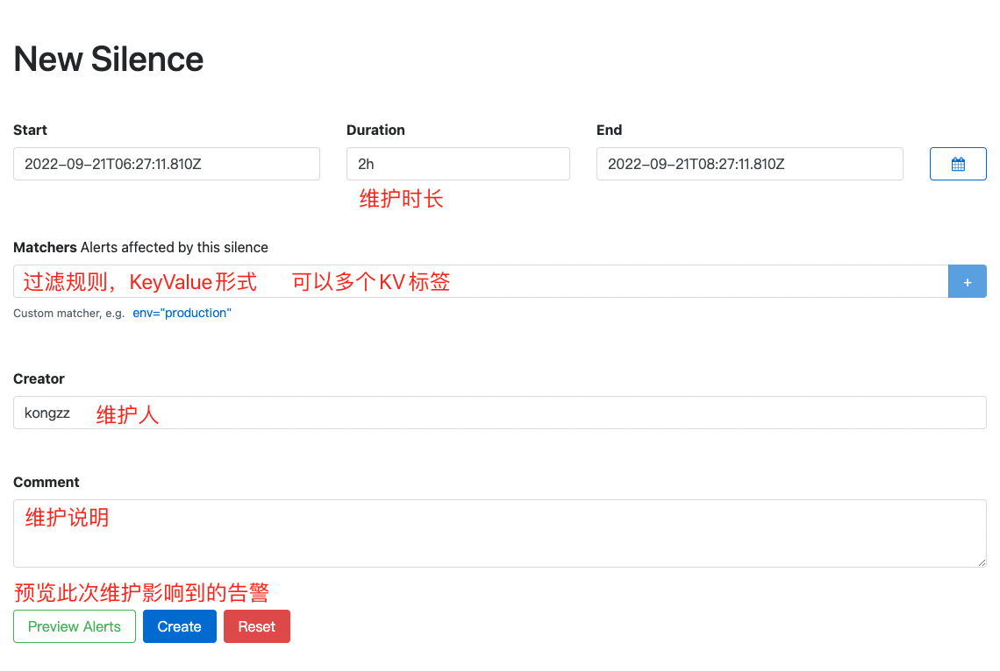
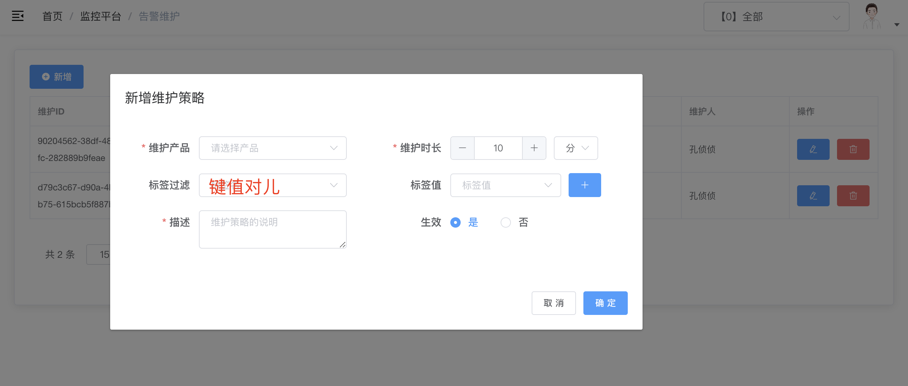

# 告警维护

游戏业务经常会有版本更新之类的操作，那么当业务正在维护中，它所有的告警应该暂停，当维护期结束之后，再激活告警

这种时候Alertmanager的silence的角色就起作用了

Alertmanager的维护有两种方式

## Alertmanager的UI页面操作



## 通过Alertmanager的API操作

```sh
curl -X POST http://127.0.0.1:9093/api/v2/silences
```

```json
{
    "matchers": [ // 维护策略标签对
        {
            "name": "alertname",
            "value": "InstanceDown",
            "isRegex": false, // 是否正则
            "isEqual": true // 是否相等
        }
    ],
    "startsAt": "2022-09-21T06:33:05.064Z",
    "endsAt": "2022-09-21T08:33:05.064Z",
    "createdBy": "kongzz",
    "comment": "测试维护"
}
```

## 更新Alertmanager的Silence

当业务预定说是维护两个小时(比如)，总归是有意外的情况出现的，需要延长维护

这种时候，要么是解除之前的维护策略，要么是更新之前的维护策略

也就是要么expire之前的维护策略，要么是update之前的维护策略

> 通过Alertmanager的UI页面操作更新很简单，直接修改duration就好了

下面我们要说的是通过API方式来更新，这里面有个小坑

```sh
curl -X POST http://127.0.0.1:9093/api/v2/silences/
```

```json
{
    "matchers": [
        {
            "name": "alertname",
            "value": "目标失联",
            "isRegex": false,
            "isEqual": true
        }
    ],
    "startsAt": "2022-09-21T06:45:23.147Z", // 这个开始时间是不能修改的，如果修改，将会生成一个新的SilenceID
    "endsAt": "2022-09-21T08:33:05.064Z", // 需要更新的是这个结束时间
    "createdBy": "kongzz",
    "comment": "asdddd",
    "id": "d150e5a0-1753-49ec-b16d-ed9707e9e132" // 当前需要修改的维护策略的SilenceID
}
```

## 解除维护

解除维护有两种方式，要么是通过API来操作，要么是通过Alertmanager的UI来expire操作

当然，维护时间到期也会自动解除

```sh
curl -X DELETE http://127.0.0.1:9093/api/v2/silence/d150e5a0-1753-49ec-b16d-ed9707e9e132
```

## 我们自研的UI操作


