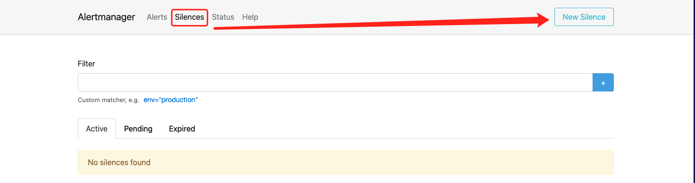
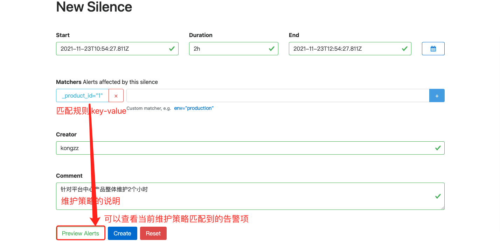

# 自研监控

> 在[游戏运维监控](./监控概述.md)中我们说到监控机制的问题，这样的采集、匹配、路由方式，其实就是在说Prometheus的这套监控机制，而我们自研的监控系统就是基于Prometheus+Alertmanager+Grafana来实现的。

## 架构图

## 监控逻辑

1. 服务端配置Prometheus 采集目标(机器、K8S、Redis、MySQL等等)
2. 服务端配置Prometheus Jobs采集任务
3. 服务端配置Alertmanager Alert Rules告警规则
4. 服务端配置Alertmanager Route路由转发规则
5. 代理端(Prometheus节点)定时获取采集目标、采集任务、告警规则，并渲染配置文件
6. 代理端(Alertmanager节点)定时获取路由转发规则，并渲染配置文件
7. 代理端(NoticeServer)根据Alertmanager的告警，发送给目标用户
8. 客户端(自研封装node exporter等)提供metrics信息
9. 代理端(Prometheus节点)根据采集目标，去抓取采集目标的metrics信息

## 产品脑图

## 前端

### 大盘列表

> 提供产品视角的Grafana图标，快速进入某个产品的Grafana视图查看监控实时状态。

### 监控大屏

> 显示某个产品下的正在发生的告警(告警数量)，具体的告警信息可以点击查看，可以针对告警配置维护时间等。

### 告警维护

> 显示了告警维护的维护策略列表，可以查看具体的告警维护策略，可以新增告警维护策略，当然在告警大屏中的【快速维护】也会显示在这里。这里的维护策略其实就是原生的Alertmanager的Silences。

> 原生Alertmanager的Silence配置是这样的

### 告警故障

> 告警列表记录当前正在发生和历史里的告警项，事故列表记录的是已经发生并处理过的告警事故，主要用于复盘记录。

### 监控对象

> 监控对象，这里是我们定义的监控目标，可以是ECS主机，K8S集群，Redis、MySQL、MongoDB、域名、IP。

- 机器默认从CMDB同步进如监控系统，并分配标签
- 机器的监控默认通过内网IP去读取metrics信息，可以配置从外网读取
- 可以针对机器设置不监控
- 可以直接点击查看机器的监控图

### 监控配置

> 监控配置是监控系统中最重要的一块，主要分监控任务、告警规则、告警路由和通知组。

- 监控任务

> 监控任务也就是对应Prometheus中的job，关于告警任务，我们定义了三种：基础任务、业务任务和探测任务。其中要说明的是业务任务就是业务方提供的metrics的URL地址，探测任务就是通过blackbox exporter来实现，就是http探测、icmp探测、tcp探测。

  - 基础任务(机器、K8S、进程、端口基础任务)
  
    

  - 业务任务

    

  - 探测任务(域名、icmp、tcp探测任务)

    

- 告警规则

> 告警规则，对应Prometheus中的alert rule。这里需要说明的是，每一条告警规则都可以有它的告警子规则，因为告警默认的告警规则是兜底的规则，如果业务方需要告警规则的阈值调整，就可以添加告警子规则。

- 告警路由

> 告警路由，对应Alertmanager中的route。这里要说明的是，每个产品下都会有一条兜底的告警路由，也就是当前产品的所有告警都默认发送给当前产品的运维人员。当然如果当前产品下不同的告警发送给不同的负责人，就需要添加告警子路由。

- 告警通知

> 告警通知，对应Alertmanager中的receiver。告警通知组就是谁需要接收告警信息。目前我们的告警通知渠道是企业微信，后续会接入钉钉、飞书等告警渠道。

### 监控管理

> 主要是配置监控的采集节点、探测的节点、监控系统的监控实例类型、告警规则类型、告警等级等监控系统的一些配置。

- 采集分组

> 就是每一个Prometheus服务。

- 探测节点

> 就是每一个blackbox exporter服务。

- 实例类型

> 我们主要定义了机器、域名、Redis、MySQL、K8S类型。

- 标签管理
- 规则类型
- 告警等级
- 大盘管理